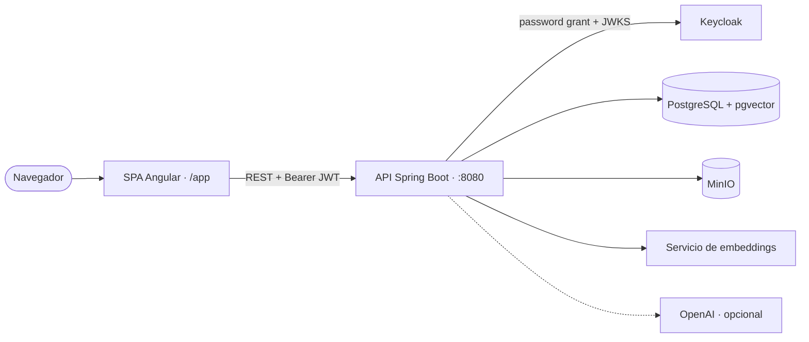

# Stella

[English](README.md) | [Português (pt-BR)](README.pt-BR.md) | Español

Stella es un proyecto cloud-native de gestión de inventario personal creado para demostrar una plataforma Java full stack con autenticación moderna, infraestructura local en contenedores, despliegue en Kubernetes y automatización de CI/CD.

Fue pensado con dos objetivos complementarios:

- portafolio: presentar un proyecto de ingeniería de software de punta a punta, cubriendo backend, frontend, infraestructura, seguridad y entrega
- aprendizaje: servir como ejemplo didáctico para que estudiantes entiendan cómo se conectan una SPA, una API protegida, bases de datos, contenedores y pipelines de despliegue

## Visión General

La aplicación combina:

- API Spring Boot 4 con Java 25
- SPA Angular 21 con PrimeNG
- Keycloak para autenticación OAuth2 / OpenID Connect
- PostgreSQL con migraciones Flyway
- Docker Compose para infraestructura local
- workflows de GitHub Actions para CI, publicación de imagen y despliegue
- métricas vía Actuator listas para Prometheus

Hoy la aplicación es una plataforma de inventario personal en funcionamiento. Los flujos implementados incluyen registro jerárquico de ubicaciones de almacenamiento, ítems maestros e instancias físicas de ítems, movimientos y préstamos, registro de personas, búsqueda semántica (vectorial) sobre el catálogo, registro asistido por IA a partir de una foto y generación de imágenes por IA, auditoría completa de cambios (Hibernate Envers) e internacionalización (pt-BR / en / es). La autenticación, la protección de rutas y los dashboards ya existen. La arquitectura está preparada para la propiedad de datos por usuario, que es el próximo paso planificado (ver [Propiedad de Datos](#propiedad-de-datos-planificado)).

> **¿Nuevo en el proyecto?** Empieza por la guía didáctica de punta a punta
> [Construir un Proyecto Similar desde Cero (Ubuntu Server)](docs/build-from-scratch/README.md),
> disponible en inglés, portugués y español, con diagramas de arquitectura, modelo de datos y
> CI/CD.

## Por Qué Importa Este Proyecto

Stella va intencionalmente más allá de un CRUD simple. Muestra cómo el código de la aplicación y las preocupaciones de plataforma evolucionan juntos:

- la autenticación queda externalizada en Keycloak, en lugar de estar hardcodeada en la aplicación
- frontend y backend forman parte del mismo flujo de entrega
- la aplicación se empaqueta para despliegue en contenedor
- los manifiestos de Kubernetes y GitHub Actions acercan el proyecto a un flujo realista de producción
- el soporte de Actuator y Prometheus abre el camino para la monitorización y la madurez operativa

Esto hace que el repositorio sea útil tanto como pieza de portafolio como referencia didáctica en desarrollo Java cloud-native.

## Arquitectura



```text
Navegador
  -> SPA Angular (/app)
  -> API Spring Boot (:8080)
  -> PostgreSQL (:5432)

Flujo de autenticación (mediado por el backend; la SPA nunca llama a Keycloak directamente)
  -> El usuario ingresa usuario/contraseña en la SPA
  -> La SPA envía las credenciales a la API
  -> La API las intercambia con Keycloak (:9080) usando el password grant de OAuth2
  -> Keycloak devuelve los tokens access/refresh a la API
  -> La API devuelve los tokens a la SPA
  -> La SPA llama a la API con bearer token
  -> La API valida la firma del JWT (JWKS de Keycloak) y procesa la solicitud
```

## Stack Tecnológico

| Capa | Tecnología |
| --- | --- |
| Backend | Spring Boot 4, Spring Security, Spring Data JPA, Flyway, Hibernate Envers, Actuator |
| Frontend | Angular 21, PrimeNG, TypeScript, design system propio |
| Identidad | Keycloak, OAuth2, OpenID Connect, JWT |
| Base de datos | PostgreSQL 17 con pgvector (búsqueda vectorial) |
| Object storage | MinIO (compatible con S3) para imágenes de los ítems |
| IA | OpenAI (análisis de foto, generación de imágenes), sidecar local de embeddings (MiniLM, 384 dims) |
| Observabilidad | Micrometer, reglas Prometheus + ServiceMonitor, logs estructurados Grafana/Loki |
| Infraestructura | Docker Compose, Kubernetes (k3s) |
| CI/CD | GitHub Actions, GHCR, escaneo de seguridad Trivy |

## Alcance Funcional Actual

Implementado y visible en el código:

- login integrado con Keycloak y rutas protegidas en Angular
- API REST Spring Boot protegida como OAuth2 resource server (JWT)
- ubicaciones jerárquicas, categorías, ítems maestros e instancias de ítems
- movimientos (entrada/salida/transferencia) y préstamos a personas
- almacenamiento de imágenes en MinIO, incluyendo registro asistido por IA vía foto y generación de imágenes por IA
- búsqueda semántica (vectorial) sobre el catálogo con pgvector y servicio local de embeddings
- auditoría completa de cambios con Hibernate Envers
- internacionalización (pt-BR / en / es) y design system propio
- migraciones con Flyway y checkpoint de esquema limpio en inglés
- entorno local en Docker y artefactos de despliegue en Kubernetes (k3s)
- workflows de CI/CD (build/prueba, publicación de imagen, despliegue) y escaneo de seguridad Trivy
- métricas vía Actuator, reglas Prometheus, ServiceMonitor y logging Grafana/Loki

Evoluciones planificadas visibles en el backlog:

- propiedad de datos por usuario (autorización horizontal) — ver [Propiedad de Datos](#propiedad-de-datos-planificado)
- límites globales (entre réplicas) de uso de IA y autoescalado (HPA)
- listados paginados e infinite scroll en el frontend para inventarios grandes

## Estructura del Repositorio

```text
.
|-- docs/                      # Documentación oficial del proyecto
|-- frontend/                  # SPA Angular
|-- k8s/                       # Manifiestos Kubernetes
|-- keycloak/                  # Archivos de importación de realm
|-- postgres/                  # Scripts de inicialización de la base de datos
|-- src/main/java/             # Código de la aplicación Spring Boot
|-- src/main/resources/        # Configuración, migraciones y assets
|-- .github/workflows/         # Pipelines de CI/CD
|-- docker-compose.yml         # Infraestructura local
`-- pom.xml                    # Build Maven, integración del frontend y pruebas
```

## Documentación Oficial

La documentación técnica oficial está disponible en [`docs/`](docs/README.md):

- [Construir un Proyecto Similar desde Cero (Ubuntu Server)](docs/build-from-scratch/README.md) — EN / PT / ES, con diagramas
- [Arquitectura](docs/architecture.md)
- [Desarrollo Local](docs/local-development.md)
- [Referencia de Configuración](docs/configuration.md)
- [Pruebas y Calidad](docs/testing.md)
- [Despliegue Kubernetes](docs/deployment.md)
- [Operaciones](docs/operations.md)

## Ejecución Local

### Prerrequisitos

- Java 25
- Maven Wrapper o Maven 3.9+
- Node.js 22+ y npm
- Docker y Docker Compose

### 1. Levantar la infraestructura

```bash
docker compose up -d
```

Esto levanta:

- PostgreSQL en `127.0.0.1:5432`
- Keycloak en `http://127.0.0.1:9080`

### 2. Ejecutar el backend

```bash
./mvnw spring-boot:run
```

En Windows PowerShell:

```powershell
.\mvnw.cmd spring-boot:run
```

La API quedará disponible en `http://127.0.0.1:8080`.

### 3. Ejecutar el frontend en modo de desarrollo

```bash
cd frontend
npm install
npm start
```

El servidor de desarrollo de Angular queda en `http://127.0.0.1:4200`.

### 4. Generar el build integrado

```bash
./mvnw clean verify
```

El build Maven instala las dependencias del frontend, genera el build de Angular y empaqueta el backend.

### 5. Ejecutar los escenarios BDD

```bash
./mvnw -Dtest=CucumberBddTest test
```

Los escenarios BDD están en Gherkin en `src/test/resources/features`, con los steps correspondientes en `src/test/java`.

## Autenticación y Acceso de Demostración

La autenticación local la realiza Keycloak en el realm `stella`.

Credenciales por defecto del admin local:

- usuario: `admin`
- contraseña: `admin123`

Usuarios y roles disponibles en la carga local del realm:

- `admin` - administrador del sistema
- `proprietario` - propietario y gestor principal de los ítems registrados
- `usuario` - usuario con acceso básico para flujos de consulta

La validación de JWT se configura en Spring Security como OAuth2 resource server.

El módulo de usuarios usa la Admin REST API de Keycloak como origen de identidad. En producción, prefiere un client confidencial dedicado con service account habilitada en lugar de reutilizar la cuenta administrativa principal de Keycloak. La API de Stella solicita el token administrativo con `client_credentials` siempre que `STELLA_KEYCLOAK_ADMIN_CLIENT_SECRET` esté configurado.

Configuraciones de identidad esperadas en producción:

- `STELLA_KEYCLOAK_ADMIN_REALM`: realm del client técnico, normalmente `stella`
- `STELLA_KEYCLOAK_ADMIN_CLIENT_ID`: id del client técnico, normalmente `stella-api-admin`
- `STELLA_KEYCLOAK_ADMIN_CLIENT_SECRET`: valor secreto del client técnico en Kubernetes

El client técnico debe recibir solo los roles necesarios de `realm-management` para operaciones de usuario en el realm `stella`, como `manage-users`, `query-users`, `view-users` y `view-realm`.

En el desarrollo local, cuando `STELLA_KEYCLOAK_ADMIN_CLIENT_SECRET` no está definido, el backend mantiene el fallback anterior y usa el administrador local configurado en `docker-compose.yml`:

- `STELLA_KEYCLOAK_ADMIN_USERNAME`
- `STELLA_KEYCLOAK_ADMIN_PASSWORD`

## API y Observabilidad

Endpoints útiles en el entorno local:

- aplicación: `http://127.0.0.1:8080/app`
- base de la API: `http://127.0.0.1:8080/api`
- OpenAPI / Scalar UI: `http://127.0.0.1:8080/scalar`
- health: `http://127.0.0.1:8080/actuator/health`
- metrics: `http://127.0.0.1:8080/actuator/metrics`
- prometheus: `http://127.0.0.1:8080/actuator/prometheus`

### Logging por Entorno

Las ejecuciones locales usan el profile por defecto de Spring y mantienen logs legibles en la consola de la aplicación. El nivel por defecto se controla con `STELLA_LOG_LEVEL` y usa `INFO` cuando la variable no está definida.

El despliegue Kubernetes activa el profile `server` con `SPRING_PROFILES_ACTIVE=server`. En ese profile, Stella emite logs estructurados ECS en JSON a stdout, que es el punto esperado de recolección para Grafana/Loki u otro recolector de logs del clúster. Labels y annotations del deployment identifican servicio, componente, destino y formato de log sin requerir escritura en archivo.

Variables útiles en el servidor:

- `STELLA_LOG_LEVEL`: nivel raíz de los logs de la aplicación
- `STELLA_SECURITY_LOG_LEVEL`: nivel de los logs de Spring Security
- `STELLA_ENVIRONMENT`: entorno incluido en los logs estructurados

No registres tokens, contraseñas, client secrets ni payloads con datos personales. La configuración mantiene el binding de parámetros SQL en `WARN` en modo servidor para evitar fugas de valores sensibles.

## Flujo de Despliegue y Entrega

El repositorio ya incluye los bloques principales de un flujo cloud-native de entrega:

- `ci.yml` valida la aplicación en pushes y pull requests
- `publish-stella-api.yml` genera y publica la imagen del contenedor
- `cd.yml` actualiza el despliegue en Kubernetes tras una publicación exitosa
- `k8s/` guarda los manifiestos usados en el clúster

Este conjunto ayuda a demostrar el paso del desarrollo local a la entrega automatizada.

## Notas Didácticas

Estudiantes y evaluadores pueden usar este repositorio para explorar:

- cómo funciona una API Spring Boot como resource server protegido por JWT
- cómo Angular y Spring Boot pueden entregarse juntos
- cómo Flyway mantiene explícita la evolución de la base de datos
- cómo Docker Compose simplifica el onboarding local
- cómo GitHub Actions puede separar responsabilidades entre CI, publicación y despliegue
- cómo las preocupaciones de observabilidad empiezan con métricas y disciplina operativa

## Propiedad de Datos (planificado)

> **Estado: planificado — aún no implementado. La base de datos ya está preparada para ello.**

Hoy el sistema es **single-tenant**: cualquier usuario autenticado ve y modifica todos los datos
de inventario. El próximo paso planificado es la **propiedad de datos por usuario** (autorización
horizontal), de modo que cada usuario solo vea sus propios registros.

La entidad base compartida ya provee una columna `external_id` indexada en cada tabla de negocio
(por ejemplo, `ix_person_external_id` existe en la migración inicial de Flyway). Esa columna es el
espacio reservado para llevar al **dueño** — el subject de Keycloak del usuario que creó el
registro. La estructura existe; lo que falta es la semántica (rellenar el dueño desde el JWT
autenticado) y el enforcement (acotar toda lectura y escritura al dueño). Hasta que esta
funcionalidad exista, trata cualquier despliegue como single-tenant.

Descripción completa y diagrama en
[Construir un Proyecto Similar desde Cero §10](docs/build-from-scratch/es.md#10-funcionalidad-planificada-ownership-de-datos-por-usuario).

## Roadmap

- evolucionar el soporte multilingüe en la interfaz
- refinar el logging en el servidor y la integración con Grafana
- implementar la propiedad de datos por usuario (ver sección anterior)
- fortalecer la documentación para contribuidores y estudiantes
- seguir endureciendo el pipeline para escenarios más cercanos a producción

## Autor

Munif Gebara Junior

Si este repositorio se está evaluando como portafolio, las señales más fuertes están en la combinación de código de aplicación, infraestructura, autenticación, observabilidad y flujo de entrega en un único sistema orientado al aprendizaje.
