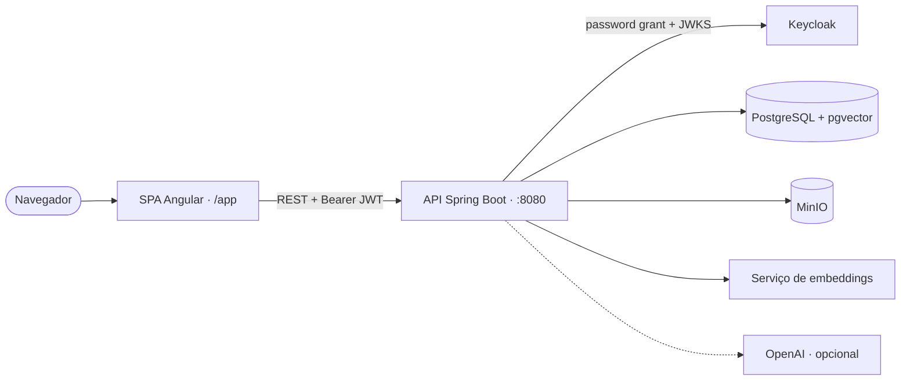

# Stella

[English](README.md) | Português (pt-BR) | [Español](README.es.md)

Stella é um projeto cloud-native de gestão de inventário pessoal criado para demonstrar uma plataforma Java full stack com autenticação moderna, infraestrutura local conteinerizada, deploy em Kubernetes e automação de CI/CD.

Ele foi pensado com dois objetivos complementares:

- portfólio: apresentar um projeto de engenharia de software ponta a ponta, cobrindo backend, frontend, infraestrutura, segurança e entrega
- aprendizado: servir como exemplo didático para estudantes entenderem como SPA, API protegida, banco de dados, containers e pipelines de deploy se conectam

## Visão Geral

A aplicação combina:

- API Spring Boot 4 com Java 25
- SPA Angular 21 com PrimeNG
- Keycloak para autenticação OAuth2 / OpenID Connect
- PostgreSQL com migrações Flyway
- Docker Compose para infraestrutura local
- manifests Kubernetes para deploy
- workflows do GitHub Actions para CI, publicação de imagem e deploy
- métricas via Actuator prontas para Prometheus

Hoje a aplicação é uma plataforma de inventário pessoal em funcionamento. Os fluxos implementados incluem cadastro hierárquico de locais de armazenagem, itens mestres e instâncias físicas de itens, movimentações e empréstimos, cadastro de pessoas, busca semântica (vetorial) no catálogo, cadastro assistido por IA a partir de uma foto e geração de imagem por IA, auditoria completa de mudanças (Hibernate Envers) e internacionalização (pt-BR / en / es). Autenticação, proteção de rotas e dashboards já existem. A arquitetura está preparada para propriedade de dados por usuário, que é o próximo passo planejado (ver [Propriedade de Dados](#propriedade-de-dados-planejado)).

> **Novo no projeto?** Comece pelo guia didático de ponta a ponta
> [Construir um Projeto Similar do Zero (Ubuntu Server)](docs/build-from-scratch/README.md),
> disponível em inglês, português e espanhol, com diagramas de arquitetura, modelo de dados e
> CI/CD.

## Por Que Este Projeto Importa

O Stella foi intencionalmente além de um CRUD simples. Ele mostra como o código da aplicação e as preocupações de plataforma evoluem juntos:

- a autenticação fica externalizada no Keycloak, em vez de estar hardcoded na aplicação
- frontend e backend fazem parte do mesmo fluxo de entrega
- a aplicação é empacotada para deploy em container
- manifests Kubernetes e GitHub Actions aproximam o projeto de um fluxo realista de produção
- suporte a Actuator e Prometheus abre caminho para monitoramento e maturidade operacional

Isso torna o repositório útil tanto como peça de portfólio quanto como referência didática em desenvolvimento Java cloud-native.

## Arquitetura



```text
Navegador
  -> SPA Angular (/app)
  -> API Spring Boot (:8080)
  -> PostgreSQL (:5432)

Fluxo de autenticação (mediado pelo backend; a SPA nunca chama o Keycloak diretamente)
  -> Usuário informa usuário/senha na SPA
  -> SPA envia as credenciais para a API
  -> API troca as credenciais com o Keycloak (:9080) usando o password grant do OAuth2
  -> Keycloak devolve os tokens access/refresh para a API
  -> API devolve os tokens para a SPA
  -> SPA chama a API com bearer token
  -> API valida a assinatura do JWT (JWKS do Keycloak) e processa a requisição
```

## Stack Tecnológica

| Camada | Tecnologia |
| --- | --- |
| Backend | Spring Boot 4, Spring Security, Spring Data JPA, Flyway, Hibernate Envers, Actuator |
| Frontend | Angular 21, PrimeNG, TypeScript, design system próprio |
| Identidade | Keycloak, OAuth2, OpenID Connect, JWT |
| Banco de dados | PostgreSQL 17 com pgvector (busca vetorial) |
| Object storage | MinIO (compatível com S3) para imagens dos itens |
| IA | OpenAI (análise de foto, geração de imagem), sidecar local de embeddings (MiniLM, 384 dims) |
| Observabilidade | Micrometer, regras Prometheus + ServiceMonitor, logs estruturados Grafana/Loki |
| Infraestrutura | Docker Compose, Kubernetes (k3s) |
| CI/CD | GitHub Actions, GHCR, scan de segurança Trivy |

## Escopo Funcional Atual

Implementado e visível no código:

- login integrado ao Keycloak e rotas protegidas no Angular
- API REST Spring Boot protegida como OAuth2 resource server (JWT)
- locais hierárquicos, categorias, itens mestres e instâncias de itens
- movimentações (entrada/saída/transferência) e empréstimos para pessoas
- armazenamento de imagens no MinIO, incluindo cadastro assistido por IA via foto e geração de imagem por IA
- busca semântica (vetorial) no catálogo com pgvector e serviço local de embeddings
- auditoria completa de mudanças com Hibernate Envers
- internacionalização (pt-BR / en / es) e design system próprio
- migrações com Flyway e checkpoint de esquema limpo em inglês
- ambiente local em Docker e artefatos de deploy em Kubernetes (k3s)
- workflows de CI/CD (build/teste, publicação de imagem, deploy) e scan de segurança Trivy
- métricas via Actuator, regras Prometheus, ServiceMonitor e logging Grafana/Loki

Evoluções planejadas visíveis no backlog:

- propriedade de dados por usuário (autorização horizontal) — ver [Propriedade de Dados](#propriedade-de-dados-planejado)
- limites globais (entre réplicas) de uso de IA e autoescalonamento (HPA)
- listagens paginadas e infinite scroll no frontend para inventários grandes

## Estrutura do Repositório

```text
.
|-- docs/                      # Documentação oficial do projeto
|-- frontend/                  # SPA Angular
|-- k8s/                       # Manifests Kubernetes
|-- keycloak/                  # Arquivos de importação de realm
|-- postgres/                  # Scripts de inicialização do banco
|-- src/main/java/             # Código da aplicação Spring Boot
|-- src/main/resources/        # Configurações, migrações e assets
|-- .github/workflows/         # Pipelines de CI/CD
|-- docker-compose.yml         # Infraestrutura local
`-- pom.xml                    # Build Maven, integração do frontend e testes
```

## Documentação Oficial

A documentação técnica oficial está disponível em [`docs/`](docs/README.md):

- [Construir um Projeto Similar do Zero (Ubuntu Server)](docs/build-from-scratch/README.md) — EN / PT / ES, com diagramas
- [Arquitetura](docs/architecture.md)
- [Desenvolvimento Local](docs/local-development.md)
- [Referência de Configuração](docs/configuration.md)
- [Testes e Qualidade](docs/testing.md)
- [Deploy Kubernetes](docs/deployment.md)
- [Operações](docs/operations.md)

## Execução Local

### Pré-requisitos

- Java 25
- Maven Wrapper ou Maven 3.9+
- Node.js 22+ e npm
- Docker e Docker Compose

### 1. Subir a infraestrutura

```bash
docker compose up -d
```

Isso sobe:

- PostgreSQL em `127.0.0.1:5432`
- Keycloak em `http://127.0.0.1:9080`

### 2. Rodar o backend

```bash
./mvnw spring-boot:run
```

No Windows PowerShell:

```powershell
.\mvnw.cmd spring-boot:run
```

A API ficará disponível em `http://127.0.0.1:8080`.

### 3. Rodar o frontend em modo de desenvolvimento

```bash
cd frontend
npm install
npm start
```

O servidor de desenvolvimento do Angular fica em `http://127.0.0.1:4200`.

### 4. Gerar o build integrado

```bash
./mvnw clean verify
```

O build Maven instala as dependências do frontend, gera o build do Angular e empacota o backend.

### 5. Rodar os cenários BDD

```bash
./mvnw -Dtest=CucumberBddTest test
```

Os cenários BDD ficam em Gherkin em `src/test/resources/features`, com os steps correspondentes em `src/test/java`.

## Autenticação e Acesso de Demonstração

A autenticação local é feita pelo Keycloak no realm `stella`.

Credenciais padrão do admin local:

- usuário: `admin`
- senha: `admin123`

Usuários e papéis disponíveis na carga local do realm:

- `admin` - administrador do sistema
- `proprietario` - proprietário e principal gestor dos itens cadastrados
- `usuario` - usuário com acesso básico para fluxos de consulta

A validação de JWT é configurada no Spring Security como OAuth2 resource server.

O módulo de usuários usa a Admin REST API do Keycloak como origem de identidade. Em produção, prefira um client confidencial dedicado com service account habilitada em vez de reutilizar a conta administrativa principal do Keycloak. A API do Stella solicita o token administrativo com `client_credentials` sempre que `STELLA_KEYCLOAK_ADMIN_CLIENT_SECRET` estiver configurado.

Configurações de identidade esperadas em produção:

- `STELLA_KEYCLOAK_ADMIN_REALM`: realm do client técnico, normalmente `stella`
- `STELLA_KEYCLOAK_ADMIN_CLIENT_ID`: id do client técnico, normalmente `stella-api-admin`
- `STELLA_KEYCLOAK_ADMIN_CLIENT_SECRET`: valor secreto do client técnico no Kubernetes

O client técnico deve receber apenas os papéis necessários de `realm-management` para operações de usuário no realm `stella`, como `manage-users`, `query-users`, `view-users` e `view-realm`.

No desenvolvimento local, quando `STELLA_KEYCLOAK_ADMIN_CLIENT_SECRET` não está definido, o backend mantém o fallback anterior e usa o administrador local configurado no `docker-compose.yml`:

- `STELLA_KEYCLOAK_ADMIN_USERNAME`
- `STELLA_KEYCLOAK_ADMIN_PASSWORD`

## API e Observabilidade

Endpoints úteis no ambiente local:

- aplicação: `http://127.0.0.1:8080/app`
- base da API: `http://127.0.0.1:8080/api`
- OpenAPI / Scalar UI: `http://127.0.0.1:8080/scalar`
- health: `http://127.0.0.1:8080/actuator/health`
- metrics: `http://127.0.0.1:8080/actuator/metrics`
- prometheus: `http://127.0.0.1:8080/actuator/prometheus`

### Logging por Ambiente

Execuções locais usam o profile padrão do Spring e mantêm logs legíveis no console da aplicação. O nível padrão é controlado por `STELLA_LOG_LEVEL` e usa `INFO` quando a variável não está definida.

O deploy Kubernetes ativa o profile `server` com `SPRING_PROFILES_ACTIVE=server`. Nesse profile, o Stella emite logs estruturados ECS em JSON no stdout, que é o ponto esperado de coleta para Grafana/Loki ou outro coletor de logs do cluster. Labels e annotations do deployment identificam serviço, componente, destino e formato de log sem exigir escrita em arquivo.

Variáveis úteis no servidor:

- `STELLA_LOG_LEVEL`: nível raiz dos logs da aplicação
- `STELLA_SECURITY_LOG_LEVEL`: nível dos logs do Spring Security
- `STELLA_ENVIRONMENT`: ambiente incluído nos logs estruturados

Não registre tokens, senhas, client secrets ou payloads com dados pessoais. A configuração mantém binding de parâmetros SQL em `WARN` no modo servidor para evitar vazamento de valores sensíveis.

## Fluxo de Deploy e Entrega

O repositório já inclui os blocos principais de um fluxo cloud-native de entrega:

- `ci.yml` valida a aplicação em pushes e pull requests
- `publish-stella-api.yml` gera e publica a imagem do container
- `cd.yml` atualiza o deploy no Kubernetes após uma publicação bem-sucedida
- `k8s/` guarda os manifests usados no cluster

Esse conjunto ajuda a demonstrar a passagem do desenvolvimento local para a entrega automatizada.

## Notas Didáticas

Estudantes e avaliadores podem usar este repositório para explorar:

- como uma API Spring Boot funciona como resource server protegido por JWT
- como Angular e Spring Boot podem ser entregues juntos
- como o Flyway mantém a evolução do banco explícita
- como o Docker Compose simplifica o onboarding local
- como GitHub Actions pode separar responsabilidades entre CI, publicação e deploy
- como preocupações de observabilidade começam com métricas e disciplina operacional

## Propriedade de Dados (planejado)

> **Status: planejado — ainda não implementado. O banco já está preparado para isso.**

Hoje o sistema é **single-tenant**: qualquer usuário autenticado vê e altera todos os dados de
inventário. O próximo passo planejado é a **propriedade de dados por usuário** (autorização
horizontal), de modo que cada usuário só veja os próprios registros.

A entidade base compartilhada já provê uma coluna `external_id` indexada em toda tabela de
negócio (por exemplo, `ix_person_external_id` existe na migration inicial do Flyway). Essa
coluna é o slot reservado para carregar o **dono** — o subject Keycloak do usuário que criou o
registro. A estrutura existe; o que falta é a semântica (preencher o dono a partir do JWT
autenticado) e o enforcement (escopar toda leitura e escrita ao dono). Até essa feature existir,
trate qualquer deploy como single-tenant.

Descrição completa e diagrama em
[Construir um Projeto Similar do Zero §10](docs/build-from-scratch/pt-BR.md#10-feature-planejada-ownership-de-dados-por-usuário).

## Roadmap

- evoluir o suporte multilíngue na interface
- refinar logging no servidor e integração com Grafana
- implementar propriedade de dados por usuário (ver seção acima)
- fortalecer a documentação para contribuidores e estudantes
- continuar endurecendo a pipeline para cenários mais próximos de produção

## Autor

Munif Gebara Junior

Se este repositório estiver sendo avaliado como portfólio, os sinais mais fortes estão na combinação de código de aplicação, infraestrutura, autenticação, observabilidade e fluxo de entrega em um único sistema orientado a aprendizado.
