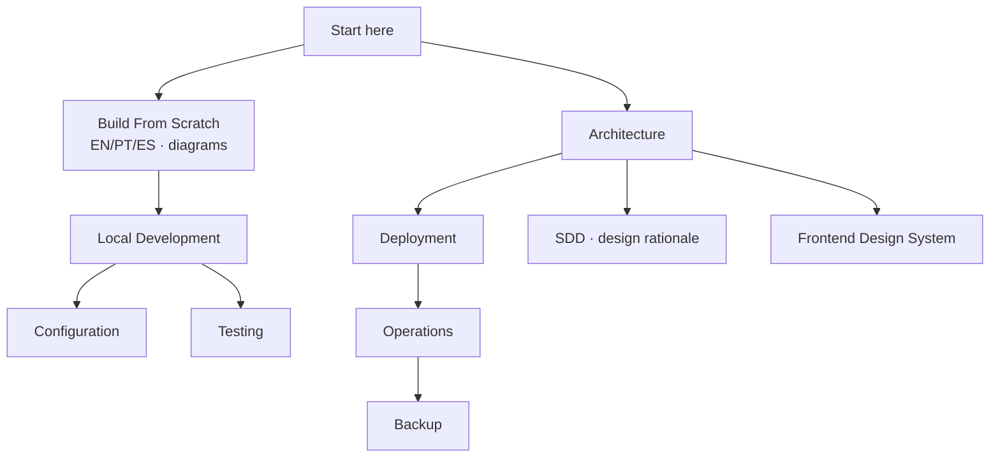

# Stella Official Documentation

This directory is the official technical documentation for Stella. It complements the root `README.md` with operational and contributor-oriented guides.

## Guides

- [Build a Similar Project From Scratch (Ubuntu Server)](build-from-scratch/README.md) — didactic EN / PT / ES walkthrough, manual and agent-assisted, with diagrams
- [Architecture](architecture.md)
- [Local Development](local-development.md)
- [Configuration Reference](configuration.md)
- [Testing and Quality](testing.md)
- [Kubernetes Deployment](deployment.md)
- [Operations](operations.md)
- [Backup and Restore](backup.md)
- [Frontend Design System](frontend-design-system.md)
- [Software Design Document (SDD)](sdd/README.md) — design rationale and decisions

## Project Summary

Stella is a cloud-native personal inventory system built with Spring Boot, Angular, Keycloak, PostgreSQL (pgvector), MinIO, Docker Compose, Kubernetes and GitHub Actions.

The application covers authenticated access, an inventory catalog (categories, master items, instances, hierarchical locations), movements and loans, image storage with AI-assisted registration and image generation, semantic search, change auditing, and a full observability and CI/CD setup. Per-user data ownership is the next planned step.

## Documentation Principles

- Keep commands executable from the repository root unless stated otherwise.
- Prefer environment variables for deploy-specific values.
- Do not document real secrets, tokens or production credentials.
- Keep local defaults development-only.
- Update these guides when changing architecture, configuration, deployment, or operational behavior.
