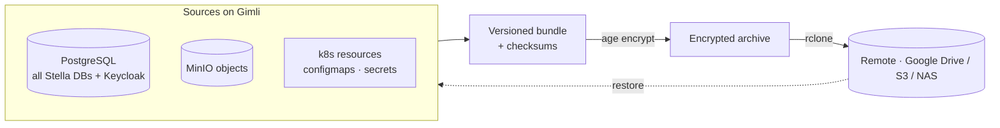

# Backup and Restore

> See also [Operations](operations.md) and [Deployment](deployment.md).

Stella backups are operational host tasks on Gimli. The repository provides scripts and templates, but credentials, private keys and the rclone configuration live only on the server.



## Design

The backup script creates a versioned bundle with independent components:

```text
backup-stella-YYYYmmdd-HHMMSS-reason/
  metadata.json
  postgres/
    globals.sql
    stella_dev.dump
    stella_staging.dump
    stella_prod.dump
    keycloak.dump
  minio/
    ...
  kubernetes/
    cluster-resources.yaml
    nodes.yaml
    namespaces.yaml
    resources.yaml
    configmaps.yaml
    secrets.enc.yaml
  checksums.sha256
```

By default, PostgreSQL backup includes all Stella databases expected on Gimli (`stella_dev`, `stella_staging`, `stella_prod`) and the related Keycloak database. The database list is configurable with `STELLA_POSTGRES_DATABASES`.

The final archive is encrypted with `age` when `STELLA_BACKUP_AGE_RECIPIENT` is configured, then uploaded with `rclone`. The initial destination is Google Drive, but the scripts only depend on an rclone remote, so the backend can later become S3, NAS or another supported remote.

The production policy is intentionally simple: the complete operational backup runs daily. CD does not run a backup step, so deploys are not blocked by large MinIO uploads. If a deployment causes a serious problem, restore from the latest daily backup.

## Gimli Setup

Install required tools on Gimli:

```bash
sudo apt-get update
sudo apt-get install -y rclone age
```

Install the MinIO client if it is not already present. Use `mcli` to avoid conflict with GNU Midnight Commander, which is also named `mc`:

```bash
curl -fsSL https://dl.min.io/client/mc/release/linux-amd64/mc -o /tmp/mcli
sudo install -m 0755 /tmp/mcli /usr/local/bin/mcli
/usr/local/bin/mcli --version
```

Configure Google Drive for the user that will run backups. If the systemd service runs the script through root, configure rclone for root:

```bash
sudo rclone config
sudo rclone mkdir gdrive:StellaBackups
sudo rclone lsd gdrive:
```

Create the age key. Store the private key only on Gimli and in an offline recovery location:

```bash
sudo install -d -m 0700 /etc/stella-backup
sudo age-keygen -o /etc/stella-backup/age-key.txt
sudo chmod 0600 /etc/stella-backup/age-key.txt
sudo grep '^# public key:' /etc/stella-backup/age-key.txt
```

Copy the example environment and set the real public recipient:

```bash
sudo cp scripts/backup/backup.env.example /etc/stella-backup/backup.env
sudo editor /etc/stella-backup/backup.env
```

On Gimli, keep the MinIO URL pointed at the local port-forward and use the explicit MinIO client path:

```bash
STELLA_MC_CMD="/usr/local/bin/mcli"
STELLA_MINIO_SERVICE_URL="http://127.0.0.1:19000"
```

The default namespace list is intentionally narrow:

```bash
STELLA_BACKUP_NAMESPACES="platform"
```

Add `monitoring` or `logging` only when those namespaces exist and you want them included in the Stella operational backup.

Install the repository checkout used by the systemd timer. One simple approach is to keep a clone under `/opt/stella-backup/current`:

```bash
sudo install -d -m 0755 /opt/stella-backup
sudo git clone https://github.com/munifgebara/cloud-native-java-pipeline.git /opt/stella-backup/current
sudo chmod +x /opt/stella-backup/current/scripts/backup/stella-backup.sh
sudo chmod +x /opt/stella-backup/current/scripts/backup/stella-restore.sh
```

## MinIO Port Forward

The host cannot resolve Kubernetes service DNS names such as `minio.platform.svc.cluster.local`. Keep a local port-forward service running on Gimli:

```bash
sudo cp /opt/stella-backup/current/scripts/backup/systemd/stella-minio-port-forward.service /etc/systemd/system/
sudo systemctl daemon-reload
sudo systemctl enable --now stella-minio-port-forward.service
sudo systemctl status stella-minio-port-forward.service --no-pager
```

## Manual Backup

Run a full backup:

```bash
sudo /opt/stella-backup/current/scripts/backup/stella-backup.sh manual
```

Check local archives:

```bash
sudo ls -lh /var/backups/stella/archives
```

Check Google Drive:

```bash
sudo rclone ls gdrive:StellaBackups
```

## Daily Schedule

Install the timer:

```bash
sudo cp /opt/stella-backup/current/scripts/backup/systemd/stella-backup.service /etc/systemd/system/
sudo cp /opt/stella-backup/current/scripts/backup/systemd/stella-backup.timer /etc/systemd/system/
sudo systemctl daemon-reload
sudo systemctl enable --now stella-backup.timer
```

Inspect runs:

```bash
systemctl list-timers stella-backup.timer
sudo journalctl -u stella-backup.service -n 200
```

## CD Policy

The CD workflow does not run backup. This avoids delaying every deploy with a full MinIO mirror and Google Drive upload.

Operational recovery after a bad CD uses the latest successful daily backup from Google Drive.

## Restore

Download the archive from Google Drive first if it is not already local:

```bash
sudo rclone copy gdrive:StellaBackups/backup-stella-YYYYmmdd-HHMMSS-daily.tar.gz.age /tmp/
```

Before restoring PostgreSQL or MinIO in a live environment, stop writers such as `stella-api` and `keycloak` or restore into an isolated test namespace/host.

Restore only PostgreSQL:

```bash
sudo /opt/stella-backup/current/scripts/backup/stella-restore.sh postgres /tmp/backup-stella-YYYYmmdd-HHMMSS-daily.tar.gz.age
```

Restore only MinIO:

```bash
sudo /opt/stella-backup/current/scripts/backup/stella-restore.sh minio /tmp/backup-stella-YYYYmmdd-HHMMSS-daily.tar.gz.age
```

Restore only Kubernetes resources and secrets:

```bash
sudo /opt/stella-backup/current/scripts/backup/stella-restore.sh kubernetes /tmp/backup-stella-YYYYmmdd-HHMMSS-daily.tar.gz.age
```

Restore everything:

```bash
sudo /opt/stella-backup/current/scripts/backup/stella-restore.sh full /tmp/backup-stella-YYYYmmdd-HHMMSS-daily.tar.gz.age
```

By default, restore commands ask for confirmation. For controlled automation, set:

```bash
sudo env STELLA_RESTORE_ASSUME_YES=true /opt/stella-backup/current/scripts/backup/stella-restore.sh postgres /tmp/backup.tar.gz.age
```

## Validation

For every operational change, validate at least:

```bash
sudo /opt/stella-backup/current/scripts/backup/stella-backup.sh manual
sudo rclone ls gdrive:StellaBackups
```

For a restore drill, prefer a safe test namespace or disposable k3s host. At minimum, test a PostgreSQL restore against a temporary database before relying on the backup for production recovery.

## Security Notes

- Do not commit `/etc/stella-backup/backup.env` if it contains real values.
- Do not commit `/etc/stella-backup/age-key.txt`.
- Google Drive is a pragmatic first remote, not the only supported design. Keep the rclone remote name configurable.
- Losing the age private key makes encrypted backups unrecoverable.
