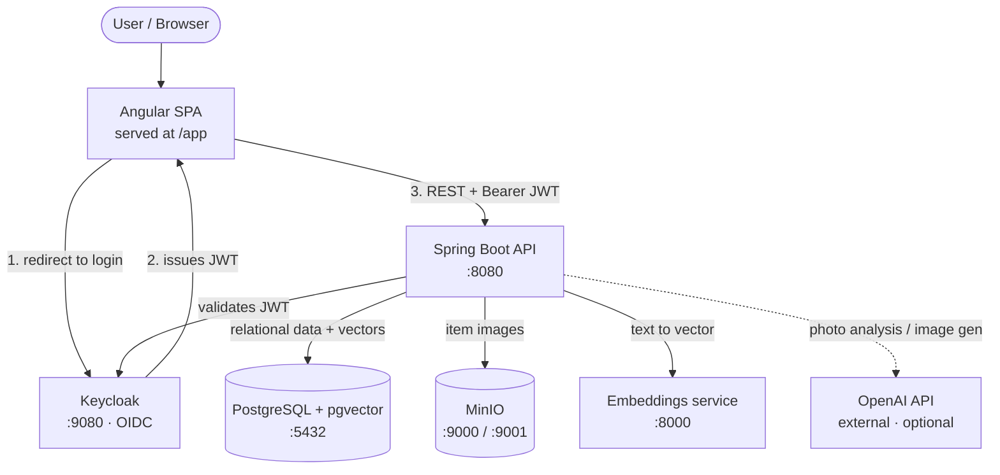
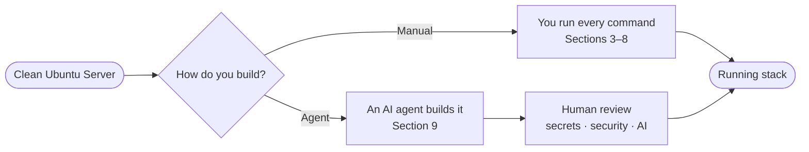
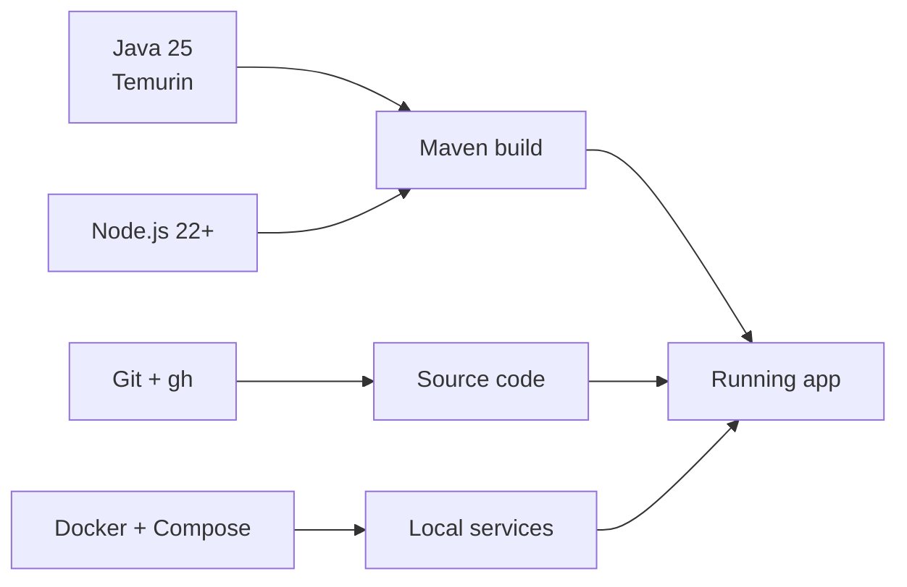
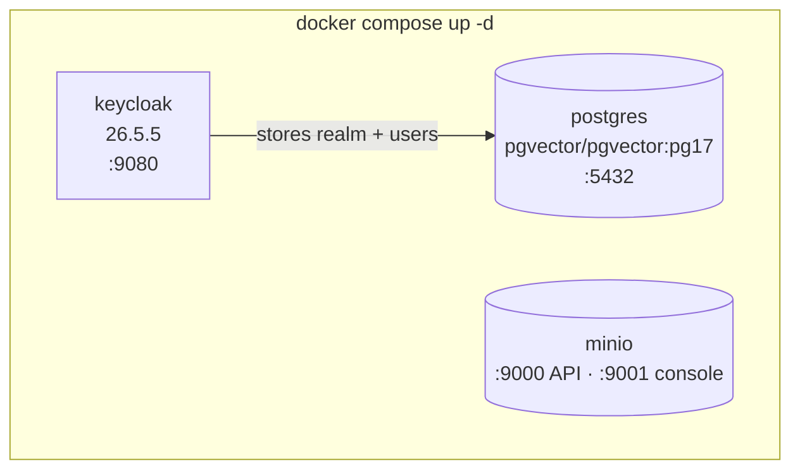
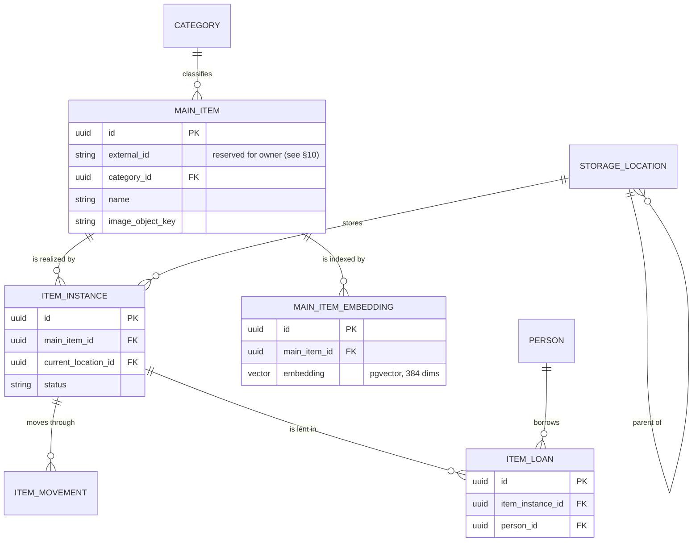
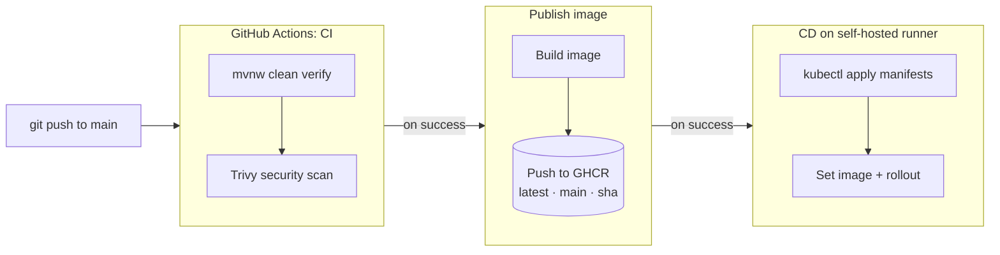
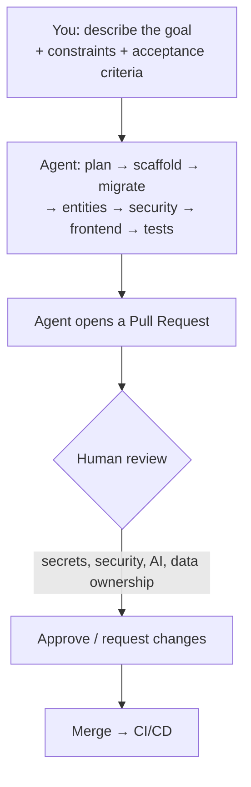
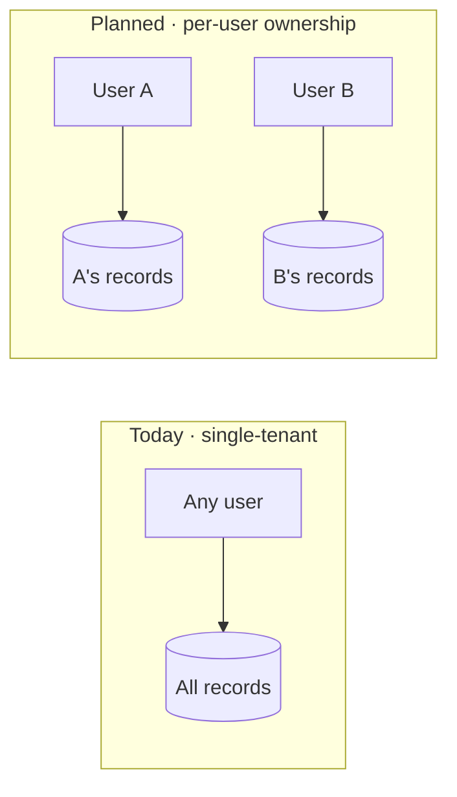

# Build a Similar Project From Scratch — Ubuntu Server (English)

🇬🇧 English · [🇧🇷 Português](pt-BR.md) · [🇪🇸 Español](es.md)

This guide teaches you how to build a cloud-native Java platform like **Stella** starting from
a **clean Ubuntu Server**. It is written to be didactic: every section explains *why*, not only
*how*. You can follow it **manually** or drive it with an **AI agent** — both paths are
described.

---

## 1. What you are building

Stella is a **personal inventory** system. The architecture below is the target you will reach
by the end of this guide.



**Reading the flow:** the browser loads the SPA, the SPA sends the user to Keycloak to log in,
Keycloak returns a signed **JWT**, and every API call carries that token. The API is a
**stateless resource server**: it validates the token's signature against Keycloak and never
stores a session. Data lives in PostgreSQL; images in MinIO; semantic search uses vectors
produced by a small embeddings service and stored via the `pgvector` extension.

### Technology choices

| Layer | Technology | Why |
| --- | --- | --- |
| Backend | Spring Boot 4, Java 25 | Mature ecosystem, strong typing, first-class security |
| Frontend | Angular 21 + PrimeNG | Batteries-included SPA framework with a component library |
| Identity | Keycloak (OAuth2 / OIDC) | Externalized auth instead of hand-rolled login |
| Database | PostgreSQL 17 + pgvector | Relational store **and** vector similarity search in one engine |
| Object storage | MinIO | S3-compatible image storage you can run locally |
| Embeddings | Local sidecar (MiniLM, 384 dims) | Turns text into vectors without paying per call |
| AI (optional) | OpenAI | Photo-to-item registration and image generation |
| Local infra | Docker Compose | One command brings up every dependency |
| Deployment | Kubernetes (k3s) | Production-style orchestration on a single server |
| CI/CD | GitHub Actions + GHCR | Automated build, image publish, and deploy |

---

## 2. The two paths



- **Manual path (Sections 3–8):** best the first time — you internalize how the pieces fit.
- **Agent path (Section 9):** fastest once you know the shape — you describe intent and review
  output. The agent still hands security, secrets, and AI decisions back to you.

---

## 3. Prepare the Ubuntu Server

Assumes Ubuntu Server 24.04 LTS, a non-root user with `sudo`, and SSH access.

```bash
# Update the base system
sudo apt update && sudo apt -y upgrade

# Essentials
sudo apt -y install curl git unzip ca-certificates gnupg lsb-release

# A dedicated working directory
mkdir -p ~/work && cd ~/work
```

**Firewall (optional but recommended).** Open only what you serve:

```bash
sudo ufw allow OpenSSH
sudo ufw allow 8080/tcp      # API (local/demo); use a reverse proxy + TLS in production
sudo ufw enable
```

> **Security note:** in a real deployment you would not expose Keycloak, PostgreSQL, or MinIO
> ports publicly. Keep them on the internal network and put only an HTTPS reverse proxy in
> front of the app.

---

## 4. Install the toolchain



**Java 25** (via SDKMAN, which makes versions easy to manage):

```bash
curl -s "https://get.sdkman.io" | bash
source "$HOME/.sdkman/bin/sdkman-init.sh"
sdk install java 25-tem
java -version    # expect openjdk 25
```

**Node.js 22+** (for the Angular build; Maven can also download its own copy):

```bash
curl -fsSL https://deb.nodesource.com/setup_22.x | sudo -E bash -
sudo apt -y install nodejs
node --version
```

**Docker Engine + Compose plugin:**

```bash
curl -fsSL https://get.docker.com | sudo sh
sudo usermod -aG docker "$USER"   # log out/in for this to take effect
docker --version
docker compose version
```

**Git and the GitHub CLI** (the CLI is handy for the agent path and CI):

```bash
sudo apt -y install git
sudo mkdir -p -m 755 /etc/apt/keyrings
type -p curl >/dev/null
curl -fsSL https://cli.github.com/packages/githubcli-archive-keyring.gpg \
  | sudo tee /etc/apt/keyrings/githubcli-archive-keyring.gpg >/dev/null
echo "deb [arch=$(dpkg --print-architecture) signed-by=/etc/apt/keyrings/githubcli-archive-keyring.gpg] https://cli.github.com/packages stable main" \
  | sudo tee /etc/apt/sources.list.d/github-cli.list >/dev/null
sudo apt update && sudo apt -y install gh
```

---

## 5. Start the local infrastructure

Stella ships a `docker-compose.yml` that defines every dependency. Conceptually:



```bash
# From the project root
docker compose up -d
docker compose ps          # all services should become healthy
```

| Service | URL | Default dev credentials |
| --- | --- | --- |
| PostgreSQL | `127.0.0.1:5432` | `stella` / `stella` (app DB) |
| Keycloak | `http://127.0.0.1:9080` | `admin` / `admin` |
| MinIO API | `http://127.0.0.1:9000` | `minioadmin` / `minioadmin` |
| MinIO Console | `http://127.0.0.1:9001` | `minioadmin` / `minioadmin` |

What happens on first start:

- **PostgreSQL** runs `postgres/init/01-init.sql` to create the `stella` and `keycloak`
  databases and enable the `vector` extension.
- **Keycloak** imports the realm from `keycloak/realm/stella-realm.json`, so the `stella`
  realm, clients, and demo users exist immediately.
- **MinIO** starts empty; the API creates the `stella-itens` bucket on the first image upload.

> These are **development-only** defaults. Never reuse them in production.

---

## 6. Understand the data model

Before building, understand the schema the Flyway migration (`V0001__create_initial_schema`)
creates. Every business table inherits a common set of infrastructure columns from a base
entity: `id` (UUID), `active` (soft delete), `created_at`, `updated_at`, `version` (optimistic
lock), plus the generic `extra` and **`external_id`** fields.



Key ideas:

- **Master/instance split** — `MAIN_ITEM` is the catalog description ("Bosch drill"),
  `ITEM_INSTANCE` is a physical unit you can move, lend, and track.
- **Hierarchical locations** — `STORAGE_LOCATION` references itself (room → shelf → box).
- **Auditing** — every table has a mirror `*_aud` table written by Hibernate Envers, so you
  get full change history.
- **Vectors** — `MAIN_ITEM_EMBEDDING` stores a 384-dimension `pgvector` column for semantic
  search.

---

## 7. Build and run the application

The Maven build is integrated: it installs frontend dependencies, builds the Angular app,
compiles the backend, runs tests, checks coverage, and packages a single jar.

```bash
# Full build with tests and coverage gate
./mvnw clean verify

# Run the API (serves the SPA at /app too)
./mvnw spring-boot:run
```

For frontend development with hot reload, run the dev server separately:

```bash
cd frontend
npm install
npm start            # http://127.0.0.1:4200
```

Configuration is environment-driven. The most useful variables (all have local defaults):

| Variable | Default | Purpose |
| --- | --- | --- |
| `STELLA_DATASOURCE_URL` | `jdbc:postgresql://127.0.0.1:5432/stella` | Database URL |
| `STELLA_KEYCLOAK_BASE_URL` | `http://127.0.0.1:9080` | Keycloak base URL |
| `STELLA_MINIO_ENDPOINT` | `http://127.0.0.1:9000` | Object storage endpoint |
| `AI_ENABLED` | `true` | Master switch for AI features |
| `OPENAI_API_KEY` | *(empty)* | Enables OpenAI photo/image features |
| `STELLA_VECTOR_SEARCH_ENABLED` | `false` | Enables semantic search |
| `SPRING_PROFILES_ACTIVE` | *(none)* | Set to `server` for JSON logs in production |

---

## 8. Validate the running stack

```bash
curl -s http://127.0.0.1:8080/actuator/health    # {"status":"UP"}
```

Then open in a browser:

- Application: `http://127.0.0.1:8080/app`
- API docs (Scalar): `http://127.0.0.1:8080/scalar`
- Metrics: `http://127.0.0.1:8080/actuator/prometheus`

Demo users (from the imported realm): `admin`, `proprietario`, `usuario`.

### Optional: deploy to Kubernetes (k3s) on the same server

```bash
curl -sfL https://get.k3s.io | sh -          # single-node Kubernetes
sudo k3s kubectl apply -R -f k8s/platform/   # apply all manifests
sudo k3s kubectl get pods -n platform
```

The CI/CD pipeline that automates this:



CI builds and tests every push and pull request; on `main`, a successful CI triggers the image
publish, which in turn triggers the deploy to k3s.

---

## 9. The agent-assisted path

You can have an AI coding agent (such as Claude Code) build this on the server for you. The
agent runs the same commands — your job shifts from *typing* to *specifying and reviewing*.



### How to drive the agent well

1. **Prerequisites on the server** — install the agent CLI, authenticate it, and scope it to
   the project directory. Give it only the permissions it needs.
2. **State intent, not keystrokes** — describe the feature, its constraints, and the
   acceptance criteria. Let the agent choose the steps.
3. **Encode project conventions** so the agent follows them automatically:
   - branch naming: `issue/NNN-short-description`
   - one feature per pull request; open the PR when the work is done
   - keep the test coverage gate green (`./mvnw clean verify`)
   - documentation in English with Portuguese/Spanish mirrors where applicable
4. **Iterate in small steps** — scaffolding → migration → entities → security → frontend →
   tests, reviewing each PR.
5. **Always keep humans on the security loop** — secrets, authorization rules, AI usage and
   cost, and anything touching personal data must be human-reviewed. The agent proposes; you
   decide.

### What stays human no matter what

- Production secrets and credentials (never commit them).
- Authentication and authorization rules (see §10 — data ownership).
- AI provider selection, limits, and cost controls.
- Final approval to merge and deploy.

---

## 10. Planned feature: per-user data ownership

> **Status: planned — not yet implemented. The database is already prepared for it.**

Today the system is effectively **single-tenant**: any authenticated user can see and modify
all inventory data. For a product called a *personal* inventory, the next step is **per-user
data ownership** (horizontal authorization), so each user only sees their own records.

**Why it is already partly prepared.** The shared base entity provides an indexed
`external_id` column on every business table (for example, `ix_person_external_id` exists in
the initial migration). This column is the reserved slot intended to carry the **owner**
(the Keycloak subject of the user who created the record). The *structure* exists; what is
missing is the *semantics and enforcement*.

**What the feature will add when implemented:**

- Populate the owner automatically from the authenticated JWT when a record is created.
- Scope every read (`listAll`, `findById`, semantic search) to the requesting owner.
- Scope every write (update/delete) so a user cannot touch another user's records — a
  cross-owner access by `id` returns `404/403`.
- Provide an explicit, audited admin path for cross-owner visibility, instead of it being the
  implicit default.



Until this feature ships, treat the deployment as single-tenant and do not store more than one
real owner's private data in it.

---

## Summary

You started from a clean Ubuntu Server and ended with a running cloud-native Java stack:
infrastructure via Docker Compose, a secured Spring Boot API serving an Angular SPA,
authentication through Keycloak, PostgreSQL with vector search, MinIO for images, optional
OpenAI features, and an optional k3s deployment driven by CI/CD. You can reproduce every step
manually or delegate them to an AI agent under your review.
