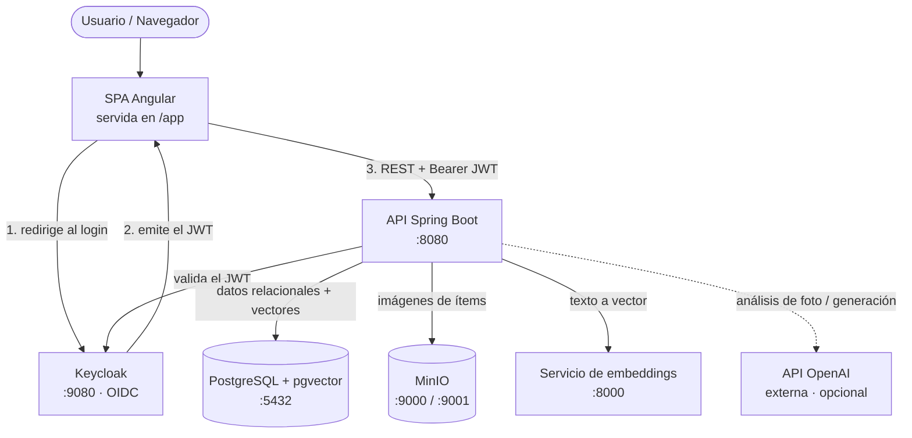
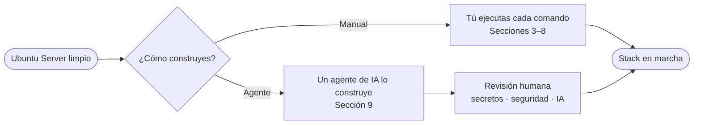
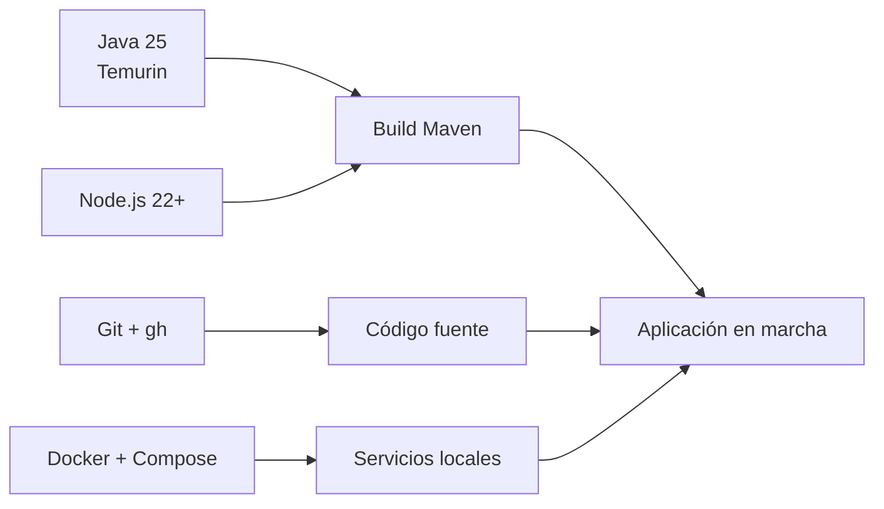
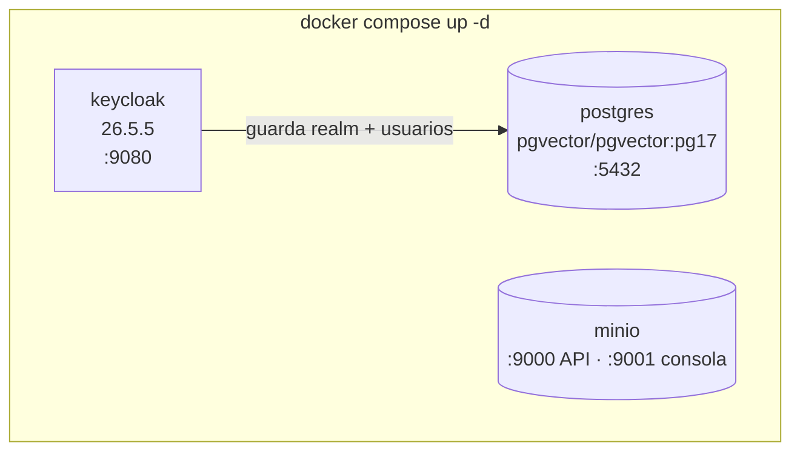
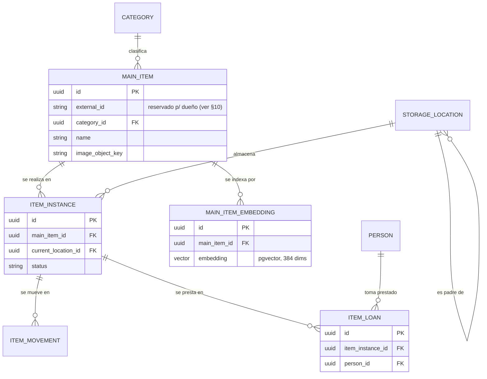
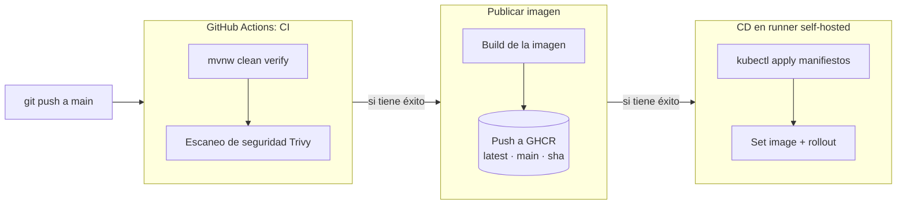
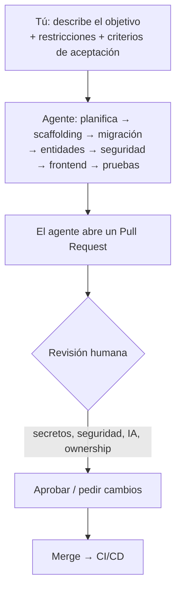
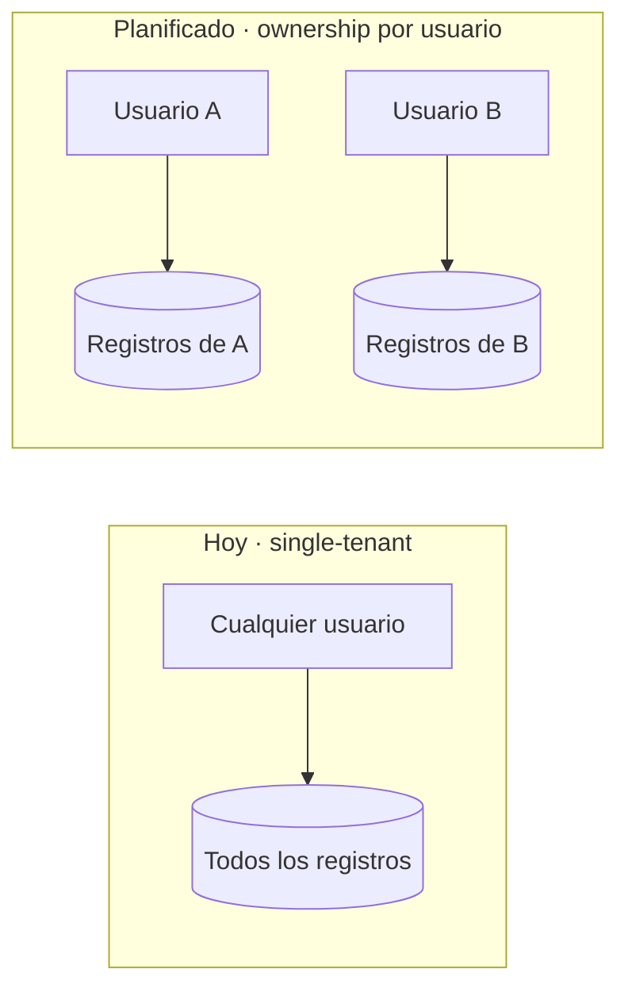

# Construir un Proyecto Similar desde Cero — Ubuntu Server (Español)

[🇬🇧 English](en.md) · [🇧🇷 Português](pt-BR.md) · 🇪🇸 Español

Esta guía enseña a construir una plataforma Java cloud-native como **Stella** partiendo de un
**Ubuntu Server limpio**. Es didáctica: cada sección explica el *porqué*, no solo el *cómo*.
Puedes seguirla **manualmente** o conducirla con un **agente de IA** — ambos caminos están
descritos.

---

## 1. Qué vas a construir

Stella es un sistema de **inventario personal**. La arquitectura de abajo es el objetivo que
alcanzarás al final de esta guía.



**Leyendo el flujo:** el navegador carga la SPA, la SPA envía al usuario a Keycloak para
iniciar sesión, Keycloak devuelve un **JWT** firmado, y cada llamada a la API lleva ese token.
La API es un **resource server sin estado**: valida la firma del token contra Keycloak y nunca
guarda sesión. Los datos viven en PostgreSQL; las imágenes en MinIO; la búsqueda semántica usa
vectores producidos por un pequeño servicio de embeddings y almacenados con la extensión
`pgvector`.

### Elecciones tecnológicas

| Capa | Tecnología | Por qué |
| --- | --- | --- |
| Backend | Spring Boot 4, Java 25 | Ecosistema maduro, tipado fuerte, seguridad de primera |
| Frontend | Angular 21 + PrimeNG | Framework SPA completo con biblioteca de componentes |
| Identidad | Keycloak (OAuth2 / OIDC) | Autenticación externalizada en vez de login casero |
| Base de datos | PostgreSQL 17 + pgvector | Almacenamiento relacional **y** búsqueda vectorial en un motor |
| Object storage | MinIO | Almacenamiento de imágenes compatible con S3, corre local |
| Embeddings | Sidecar local (MiniLM, 384 dims) | Convierte texto en vectores sin costo por llamada |
| IA (opcional) | OpenAI | Registro por foto y generación de imágenes |
| Infra local | Docker Compose | Un comando levanta todas las dependencias |
| Despliegue | Kubernetes (k3s) | Orquestación estilo producción en un solo servidor |
| CI/CD | GitHub Actions + GHCR | Build, publicación de imagen y despliegue automatizados |

---

## 2. Los dos caminos



- **Camino manual (Secciones 3–8):** mejor la primera vez — internalizas cómo encajan las
  piezas.
- **Camino con agente (Sección 9):** más rápido cuando ya conoces la forma — describes la
  intención y revisas el resultado. El agente sigue devolviéndote las decisiones de seguridad,
  secretos e IA.

---

## 3. Preparar el Ubuntu Server

Asume Ubuntu Server 24.04 LTS, un usuario no-root con `sudo` y acceso SSH.

```bash
# Actualizar el sistema base
sudo apt update && sudo apt -y upgrade

# Esenciales
sudo apt -y install curl git unzip ca-certificates gnupg lsb-release

# Un directorio de trabajo dedicado
mkdir -p ~/work && cd ~/work
```

**Firewall (opcional pero recomendado).** Abre solo lo que sirves:

```bash
sudo ufw allow OpenSSH
sudo ufw allow 8080/tcp      # API (local/demo); en producción usa proxy inverso + TLS
sudo ufw enable
```

> **Nota de seguridad:** en un despliegue real no expones los puertos de Keycloak, PostgreSQL o
> MinIO públicamente. Mantenlos en la red interna y pon solo un proxy inverso HTTPS frente a la
> aplicación.

---

## 4. Instalar el toolchain



**Java 25** (vía SDKMAN, que facilita gestionar versiones):

```bash
curl -s "https://get.sdkman.io" | bash
source "$HOME/.sdkman/bin/sdkman-init.sh"
sdk install java 25-tem
java -version    # esperado: openjdk 25
```

**Node.js 22+** (para el build de Angular; Maven también descarga su propia copia):

```bash
curl -fsSL https://deb.nodesource.com/setup_22.x | sudo -E bash -
sudo apt -y install nodejs
node --version
```

**Docker Engine + plugin Compose:**

```bash
curl -fsSL https://get.docker.com | sudo sh
sudo usermod -aG docker "$USER"   # cierra y abre sesión para que tome efecto
docker --version
docker compose version
```

**Git y la CLI de GitHub** (la CLI ayuda en el camino con agente y en la CI):

```bash
sudo apt -y install git
sudo mkdir -p -m 755 /etc/apt/keyrings
curl -fsSL https://cli.github.com/packages/githubcli-archive-keyring.gpg \
  | sudo tee /etc/apt/keyrings/githubcli-archive-keyring.gpg >/dev/null
echo "deb [arch=$(dpkg --print-architecture) signed-by=/etc/apt/keyrings/githubcli-archive-keyring.gpg] https://cli.github.com/packages stable main" \
  | sudo tee /etc/apt/sources.list.d/github-cli.list >/dev/null
sudo apt update && sudo apt -y install gh
```

---

## 5. Levantar la infraestructura local

Stella incluye un `docker-compose.yml` que define todas las dependencias. Conceptualmente:



```bash
# Desde la raíz del proyecto
docker compose up -d
docker compose ps          # todos los servicios deben quedar healthy
```

| Servicio | URL | Credenciales por defecto (dev) |
| --- | --- | --- |
| PostgreSQL | `127.0.0.1:5432` | `stella` / `stella` (BD de la app) |
| Keycloak | `http://127.0.0.1:9080` | `admin` / `admin` |
| MinIO API | `http://127.0.0.1:9000` | `minioadmin` / `minioadmin` |
| MinIO Consola | `http://127.0.0.1:9001` | `minioadmin` / `minioadmin` |

Qué ocurre en el primer arranque:

- **PostgreSQL** ejecuta `postgres/init/01-init.sql` para crear las bases `stella` y `keycloak`
  y habilitar la extensión `vector`.
- **Keycloak** importa el realm desde `keycloak/realm/stella-realm.json`, así el realm
  `stella`, los clients y los usuarios de demo ya existen.
- **MinIO** inicia vacío; la API crea el bucket `stella-itens` en la primera subida de imagen.

> Estos son valores **solo de desarrollo**. Nunca los reutilices en producción.

---

## 6. Entender el modelo de datos

Antes de construir, entiende el esquema que crea la migración Flyway
(`V0001__create_initial_schema`). Cada tabla de negocio hereda un conjunto común de columnas de
infraestructura de una entidad base: `id` (UUID), `active` (borrado lógico), `created_at`,
`updated_at`, `version` (bloqueo optimista), además de los campos genéricos `extra` y
**`external_id`**.



Ideas clave:

- **Separación maestro/instancia** — `MAIN_ITEM` es la descripción de catálogo ("taladro
  Bosch"), `ITEM_INSTANCE` es la unidad física que mueves, prestas y rastreas.
- **Ubicaciones jerárquicas** — `STORAGE_LOCATION` se referencia a sí misma (sala → estante →
  caja).
- **Auditoría** — cada tabla tiene un espejo `*_aud` escrito por Hibernate Envers, así obtienes
  historial completo de cambios.
- **Vectores** — `MAIN_ITEM_EMBEDDING` guarda una columna `pgvector` de 384 dimensiones para
  búsqueda semántica.

---

## 7. Compilar y ejecutar la aplicación

El build de Maven es integrado: instala dependencias del frontend, compila la app Angular,
compila el backend, ejecuta pruebas, verifica cobertura y empaqueta un único jar.

```bash
# Build completo con pruebas y gate de cobertura
./mvnw clean verify

# Ejecutar la API (también sirve la SPA en /app)
./mvnw spring-boot:run
```

Para desarrollo de frontend con hot reload, ejecuta el dev server por separado:

```bash
cd frontend
npm install
npm start            # http://127.0.0.1:4200
```

La configuración es por variables de entorno. Las más útiles (todas con valor local):

| Variable | Por defecto | Función |
| --- | --- | --- |
| `STELLA_DATASOURCE_URL` | `jdbc:postgresql://127.0.0.1:5432/stella` | URL de la base de datos |
| `STELLA_KEYCLOAK_BASE_URL` | `http://127.0.0.1:9080` | URL base de Keycloak |
| `STELLA_MINIO_ENDPOINT` | `http://127.0.0.1:9000` | Endpoint del object storage |
| `AI_ENABLED` | `true` | Interruptor maestro de las funciones de IA |
| `OPENAI_API_KEY` | *(vacío)* | Habilita funciones OpenAI (foto/imagen) |
| `STELLA_VECTOR_SEARCH_ENABLED` | `false` | Habilita la búsqueda semántica |
| `SPRING_PROFILES_ACTIVE` | *(ninguno)* | Usa `server` para logs JSON en producción |

---

## 8. Validar el stack en ejecución

```bash
curl -s http://127.0.0.1:8080/actuator/health    # {"status":"UP"}
```

Luego abre en el navegador:

- Aplicación: `http://127.0.0.1:8080/app`
- Docs de la API (Scalar): `http://127.0.0.1:8080/scalar`
- Métricas: `http://127.0.0.1:8080/actuator/prometheus`

Usuarios de demo (del realm importado): `admin`, `proprietario`, `usuario`.

### Opcional: desplegar en Kubernetes (k3s) en el mismo servidor

```bash
curl -sfL https://get.k3s.io | sh -          # Kubernetes de un solo nodo
sudo k3s kubectl apply -R -f k8s/platform/   # aplica todos los manifiestos
sudo k3s kubectl get pods -n platform
```

El pipeline CI/CD que lo automatiza:



La CI compila y prueba cada push y pull request; en `main`, una CI exitosa dispara la
publicación de la imagen, que a su vez dispara el despliegue en k3s.

---

## 9. El camino con agente de IA

Puedes pedir a un agente de codificación (como Claude Code) que construya esto en el servidor
por ti. El agente ejecuta los mismos comandos — tu rol pasa de *teclear* a *especificar y
revisar*.



### Cómo conducir bien al agente

1. **Prerrequisitos en el servidor** — instala la CLI del agente, autentícala y restríngela al
   directorio del proyecto. Dale solo los permisos necesarios.
2. **Indica la intención, no las teclas** — describe la funcionalidad, sus restricciones y los
   criterios de aceptación. Deja que el agente elija los pasos.
3. **Codifica las convenciones del proyecto** para que el agente las siga automáticamente:
   - nombre de rama: `issue/NNN-descripcion-corta`
   - una funcionalidad por pull request; abrir el PR al terminar
   - mantener el gate de cobertura en verde (`./mvnw clean verify`)
   - documentación en inglés con espejos en portugués/español cuando aplique
4. **Itera en pasos pequeños** — scaffolding → migración → entidades → seguridad → frontend →
   pruebas, revisando cada PR.
5. **Mantén siempre al humano en el lazo de seguridad** — secretos, reglas de autorización, uso
   y costo de IA, y cualquier cosa que toque datos personales requieren revisión humana. El
   agente propone; tú decides.

### Qué permanece humano de todos modos

- Secretos y credenciales de producción (nunca los hagas commit).
- Reglas de autenticación y autorización (ver §10 — ownership de datos).
- Elección del proveedor de IA, límites y controles de costo.
- Aprobación final para merge y despliegue.

---

## 10. Funcionalidad planificada: ownership de datos por usuario

> **Estado: planificada — aún no implementada. La base de datos ya está preparada para ella.**

Hoy el sistema es, en la práctica, **single-tenant**: cualquier usuario autenticado ve y
modifica todos los datos del inventario. Para un producto llamado inventario *personal*, el
siguiente paso es el **ownership de datos por usuario** (autorización horizontal), de modo que
cada usuario solo vea sus propios registros.

**Por qué ya está parcialmente preparado.** La entidad base compartida provee una columna
`external_id` indexada en cada tabla de negocio (por ejemplo, `ix_person_external_id` existe en
la migración inicial). Esa columna es el espacio reservado para llevar al **dueño** (el subject
de Keycloak del usuario que creó el registro). La *estructura* existe; lo que falta es la
*semántica y el enforcement*.

**Qué añadirá la funcionalidad cuando se implemente:**

- Rellenar el dueño automáticamente desde el JWT autenticado al crear un registro.
- Acotar toda lectura (`listAll`, `findById`, búsqueda semántica) al dueño solicitante.
- Acotar toda escritura (update/delete) para que un usuario no toque los registros de otro —
  un acceso cruzado por `id` devuelve `404/403`.
- Ofrecer un camino admin explícito y auditado para visibilidad cruzada, en vez de que sea el
  comportamiento implícito por defecto.



Hasta que esta funcionalidad exista, trata el despliegue como single-tenant y no almacenes en
él datos privados de más de un dueño real.

---

## Resumen

Empezaste desde un Ubuntu Server limpio y terminaste con un stack Java cloud-native en marcha:
infraestructura vía Docker Compose, una API Spring Boot segura sirviendo una SPA Angular,
autenticación con Keycloak, PostgreSQL con búsqueda vectorial, MinIO para imágenes, funciones
OpenAI opcionales y un despliegue k3s opcional conducido por CI/CD. Puedes reproducir cada paso
manualmente o delegarlos a un agente de IA bajo tu revisión.
