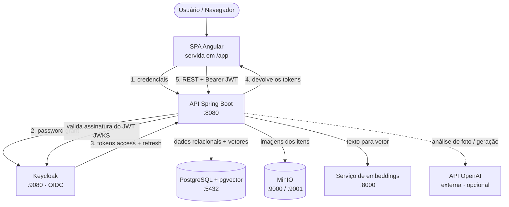
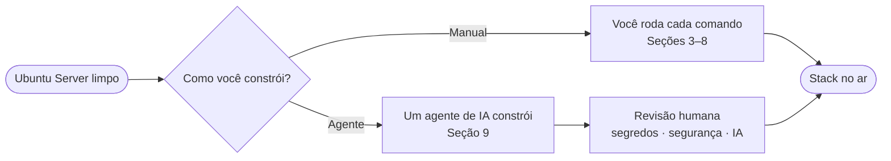
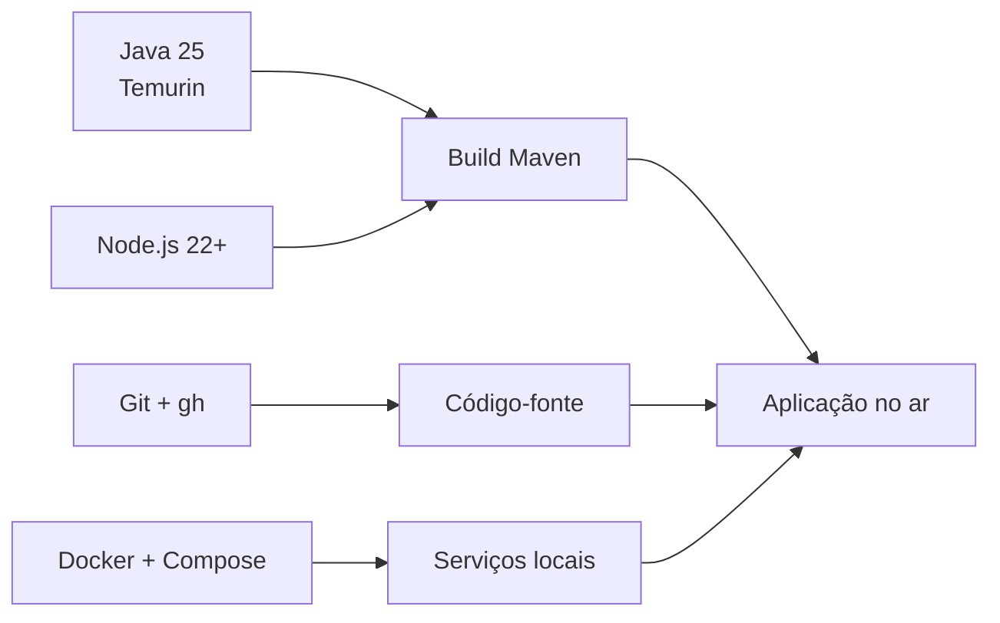
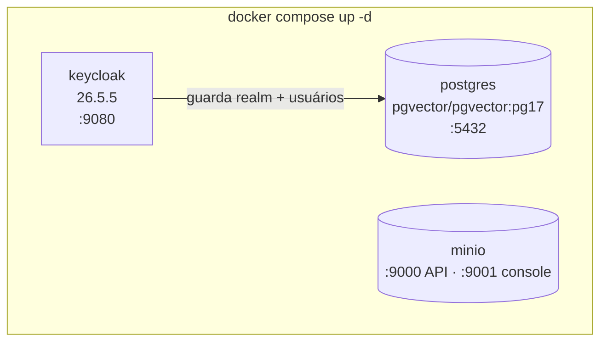
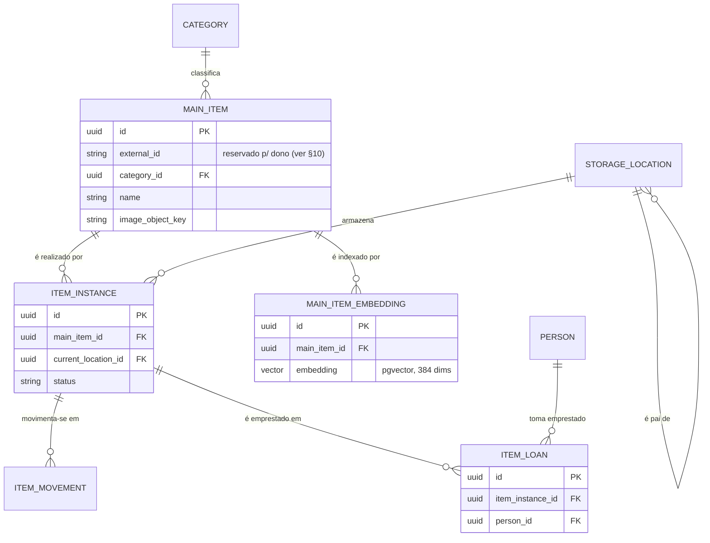
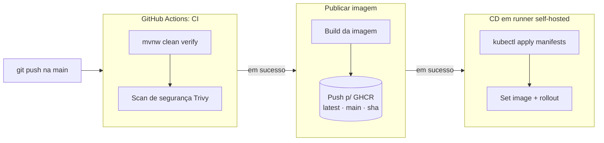
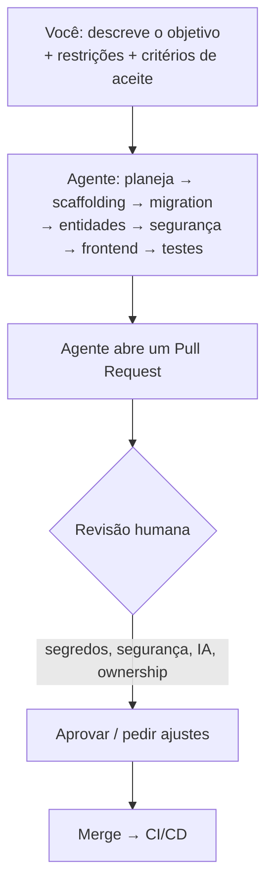
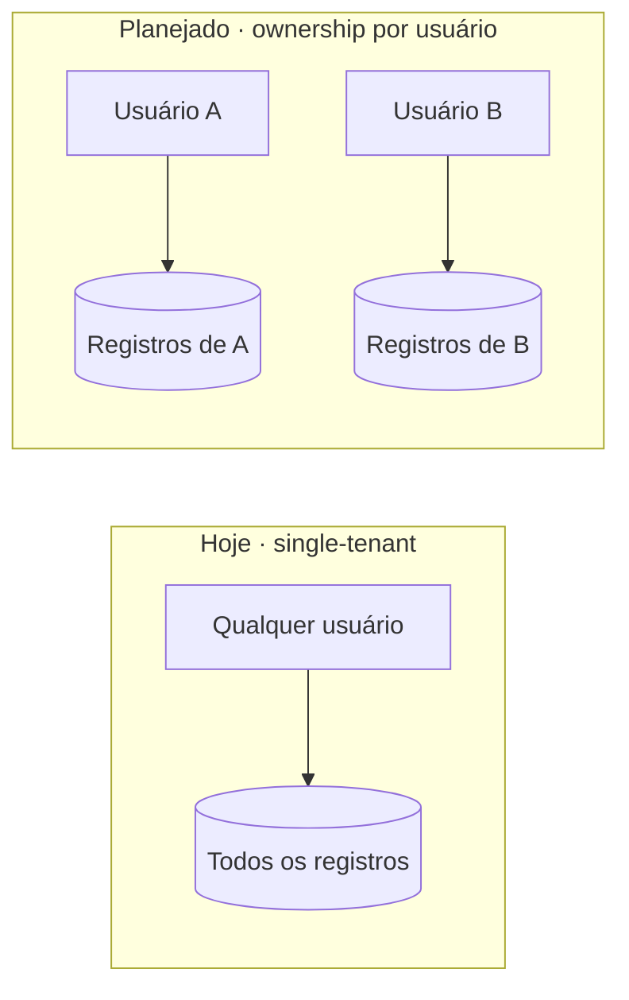

# Construir um Projeto Similar do Zero — Ubuntu Server (Português)

[🇬🇧 English](en.md) · 🇧🇷 Português · [🇪🇸 Español](es.md)

Este guia ensina a construir uma plataforma Java cloud-native como a **Stella** partindo de um
**Ubuntu Server limpo**. Ele é didático: cada seção explica o *porquê*, não só o *como*. Você
pode seguir **manualmente** ou conduzir com um **agente de IA** — os dois caminhos são
descritos.

---

## 1. O que você vai construir

A Stella é um sistema de **inventário pessoal**. A arquitetura abaixo é o alvo que você
alcançará ao fim deste guia.



**Lendo o fluxo:** o navegador carrega a SPA, e a SPA fala **apenas com a API** — ela nunca
contata o Keycloak diretamente. Para fazer login, a SPA envia usuário e senha para a API; a API
troca essas credenciais com o Keycloak usando o **password grant** do OAuth2 e devolve o **JWT**
resultante (tokens access + refresh) para a SPA. Toda chamada seguinte carrega esse token como
header Bearer. A API é um **resource server sem estado**: valida a assinatura do token contra as
chaves públicas do Keycloak (JWKS) e nunca guarda sessão. Os dados ficam no PostgreSQL; as
imagens no MinIO; a busca semântica usa vetores produzidos por um pequeno serviço de embeddings
e armazenados pela extensão `pgvector`.

### Escolhas de tecnologia

| Camada | Tecnologia | Por quê |
| --- | --- | --- |
| Backend | Spring Boot 4, Java 25 | Ecossistema maduro, tipagem forte, segurança de primeira |
| Frontend | Angular 21 + PrimeNG | Framework SPA completo com biblioteca de componentes |
| Identidade | Keycloak (OAuth2 / OIDC) | Autenticação externalizada em vez de login caseiro |
| Banco | PostgreSQL 17 + pgvector | Armazenamento relacional **e** busca vetorial no mesmo motor |
| Object storage | MinIO | Armazenamento de imagens compatível com S3, roda local |
| Embeddings | Sidecar local (MiniLM, 384 dims) | Converte texto em vetores sem custo por chamada |
| IA (opcional) | OpenAI | Cadastro por foto e geração de imagem |
| Infra local | Docker Compose | Um comando sobe todas as dependências |
| Deploy | Kubernetes (k3s) | Orquestração estilo produção em um único servidor |
| CI/CD | GitHub Actions + GHCR | Build, publicação de imagem e deploy automatizados |

---

## 2. Os dois caminhos



- **Caminho manual (Seções 3–8):** melhor na primeira vez — você internaliza como as peças se
  encaixam.
- **Caminho com agente (Seção 9):** mais rápido depois que você conhece o formato — descreve a
  intenção e revisa o resultado. O agente ainda devolve a você as decisões de segurança,
  segredos e IA.

---

## 3. Preparar o Ubuntu Server

Assume Ubuntu Server 24.04 LTS, um usuário não-root com `sudo` e acesso SSH.

```bash
# Atualizar o sistema base
sudo apt update && sudo apt -y upgrade

# Itens essenciais
sudo apt -y install curl git unzip ca-certificates gnupg lsb-release

# Um diretório de trabalho dedicado
mkdir -p ~/work && cd ~/work
```

**Firewall (opcional, mas recomendado).** Abra só o que você serve:

```bash
sudo ufw allow OpenSSH
sudo ufw allow 8080/tcp      # API (local/demo); em produção use proxy reverso + TLS
sudo ufw enable
```

> **Nota de segurança:** num deploy real você não expõe as portas do Keycloak, PostgreSQL ou
> MinIO publicamente. Mantenha-as na rede interna e coloque apenas um proxy reverso HTTPS na
> frente da aplicação.

---

## 4. Instalar o toolchain



**Java 25** (via SDKMAN, que facilita gerenciar versões):

```bash
curl -s "https://get.sdkman.io" | bash
source "$HOME/.sdkman/bin/sdkman-init.sh"
sdk install java 25-tem
java -version    # esperado: openjdk 25
```

**Node.js 22+** (para o build do Angular; o Maven também baixa a própria cópia):

```bash
curl -fsSL https://deb.nodesource.com/setup_22.x | sudo -E bash -
sudo apt -y install nodejs
node --version
```

**Docker Engine + plugin Compose:**

```bash
curl -fsSL https://get.docker.com | sudo sh
sudo usermod -aG docker "$USER"   # saia e entre novamente para valer
docker --version
docker compose version
```

**Git e a CLI do GitHub** (a CLI ajuda no caminho com agente e na CI):

```bash
sudo apt -y install git
sudo mkdir -p -m 755 /etc/apt/keyrings
curl -fsSL https://cli.github.com/packages/githubcli-archive-keyring.gpg \
  | sudo tee /etc/apt/keyrings/githubcli-archive-keyring.gpg >/dev/null
echo "deb [arch=$(dpkg --print-architecture) signed-by=/etc/apt/keyrings/githubcli-archive-keyring.gpg] https://cli.github.com/packages stable main" \
  | sudo tee /etc/apt/sources.list.d/github-cli.list >/dev/null
sudo apt update && sudo apt -y install gh
```

---

## 5. Subir a infraestrutura local

A Stella traz um `docker-compose.yml` que define todas as dependências. Conceitualmente:



```bash
# A partir da raiz do projeto
docker compose up -d
docker compose ps          # todos os serviços devem ficar healthy
```

| Serviço | URL | Credenciais padrão (dev) |
| --- | --- | --- |
| PostgreSQL | `127.0.0.1:5432` | `stella` / `stella` (banco da app) |
| Keycloak | `http://127.0.0.1:9080` | `admin` / `admin` |
| MinIO API | `http://127.0.0.1:9000` | `minioadmin` / `minioadmin` |
| MinIO Console | `http://127.0.0.1:9001` | `minioadmin` / `minioadmin` |

O que acontece no primeiro start:

- **PostgreSQL** roda `postgres/init/01-init.sql` para criar os bancos `stella` e `keycloak` e
  habilitar a extensão `vector`.
- **Keycloak** importa o realm de `keycloak/realm/stella-realm.json`, então o realm `stella`,
  os clients e os usuários de demo já existem.
- **MinIO** inicia vazio; a API cria o bucket `stella-itens` no primeiro upload de imagem.

> Esses são padrões **apenas de desenvolvimento**. Nunca os reutilize em produção.

---

## 6. Entender o modelo de dados

Antes de construir, entenda o esquema que a migration Flyway
(`V0001__create_initial_schema`) cria. Toda tabela de negócio herda um conjunto comum de
colunas de infraestrutura de uma entidade base: `id` (UUID), `active` (soft delete),
`created_at`, `updated_at`, `version` (lock otimista), além dos campos genéricos `extra` e
**`external_id`**.



Ideias-chave:

- **Separação mestre/instância** — `MAIN_ITEM` é a descrição de catálogo ("furadeira Bosch"),
  `ITEM_INSTANCE` é a unidade física que você move, empresta e rastreia.
- **Locais hierárquicos** — `STORAGE_LOCATION` referencia a si mesmo (sala → prateleira →
  caixa).
- **Auditoria** — toda tabela tem uma espelho `*_aud` escrita pelo Hibernate Envers, então
  você tem histórico completo de mudanças.
- **Vetores** — `MAIN_ITEM_EMBEDDING` guarda uma coluna `pgvector` de 384 dimensões para busca
  semântica.

---

## 7. Compilar e executar a aplicação

O build Maven é integrado: instala dependências do frontend, compila o app Angular, compila o
backend, roda testes, verifica cobertura e empacota um único jar.

```bash
# Build completo com testes e gate de cobertura
./mvnw clean verify

# Executar a API (também serve a SPA em /app)
./mvnw spring-boot:run
```

Para desenvolvimento de frontend com hot reload, rode o dev server à parte:

```bash
cd frontend
npm install
npm start            # http://127.0.0.1:4200
```

A configuração é por variáveis de ambiente. As mais úteis (todas têm padrão local):

| Variável | Padrão | Função |
| --- | --- | --- |
| `STELLA_DATASOURCE_URL` | `jdbc:postgresql://127.0.0.1:5432/stella` | URL do banco |
| `STELLA_KEYCLOAK_BASE_URL` | `http://127.0.0.1:9080` | URL base do Keycloak |
| `STELLA_MINIO_ENDPOINT` | `http://127.0.0.1:9000` | Endpoint do object storage |
| `AI_ENABLED` | `true` | Chave-mestra das funções de IA |
| `OPENAI_API_KEY` | *(vazio)* | Habilita funções OpenAI (foto/imagem) |
| `STELLA_VECTOR_SEARCH_ENABLED` | `false` | Habilita a busca semântica |
| `SPRING_PROFILES_ACTIVE` | *(nenhum)* | Use `server` para logs JSON em produção |

---

## 8. Validar a stack em execução

```bash
curl -s http://127.0.0.1:8080/actuator/health    # {"status":"UP"}
```

Depois abra no navegador:

- Aplicação: `http://127.0.0.1:8080/app`
- Docs da API (Scalar): `http://127.0.0.1:8080/scalar`
- Métricas: `http://127.0.0.1:8080/actuator/prometheus`

Usuários de demo (do realm importado): `admin`, `proprietario`, `usuario`.

### Opcional: deploy em Kubernetes (k3s) no mesmo servidor

```bash
curl -sfL https://get.k3s.io | sh -          # Kubernetes de nó único
sudo k3s kubectl apply -R -f k8s/platform/   # aplica todos os manifests
sudo k3s kubectl get pods -n platform
```

O pipeline CI/CD que automatiza isso:



A CI compila e testa cada push e pull request; na `main`, uma CI bem-sucedida dispara a
publicação da imagem, que por sua vez dispara o deploy no k3s.

---

## 9. O caminho com agente de IA

Você pode pedir a um agente de codificação (como o Claude Code) que construa isso no servidor
por você. O agente roda os mesmos comandos — seu papel muda de *digitar* para *especificar e
revisar*.



### Como conduzir bem o agente

1. **Pré-requisitos no servidor** — instale a CLI do agente, autentique e restrinja ao
   diretório do projeto. Dê só as permissões necessárias.
2. **Diga a intenção, não as teclas** — descreva a feature, as restrições e os critérios de
   aceite. Deixe o agente escolher os passos.
3. **Codifique as convenções do projeto** para o agente segui-las automaticamente:
   - nome de branch: `issue/NNN-descricao-curta`
   - uma feature por pull request; abrir o PR ao terminar
   - manter o gate de cobertura verde (`./mvnw clean verify`)
   - documentação em inglês com espelhos em português/espanhol quando aplicável
4. **Itere em passos pequenos** — scaffolding → migration → entidades → segurança → frontend →
   testes, revisando cada PR.
5. **Mantenha sempre o humano no laço de segurança** — segredos, regras de autorização, uso e
   custo de IA, e qualquer coisa que toque dados pessoais precisam de revisão humana. O agente
   propõe; você decide.

### O que permanece humano de qualquer forma

- Segredos e credenciais de produção (nunca commite).
- Regras de autenticação e autorização (ver §10 — ownership de dados).
- Escolha do provedor de IA, limites e controles de custo.
- Aprovação final para merge e deploy.

---

## 10. Feature planejada: ownership de dados por usuário

> **Status: planejada — ainda não implementada. O banco já está preparado para ela.**

Hoje o sistema é, na prática, **single-tenant**: qualquer usuário autenticado vê e altera todos
os dados de inventário. Para um produto chamado de inventário *pessoal*, o próximo passo é o
**ownership de dados por usuário** (autorização horizontal), de modo que cada usuário só veja
os próprios registros.

**Por que já está parcialmente preparado.** A entidade base compartilhada provê uma coluna
`external_id` indexada em toda tabela de negócio (por exemplo, `ix_person_external_id` existe na
migration inicial). Essa coluna é o slot reservado para carregar o **dono** (o subject Keycloak
do usuário que criou o registro). A *estrutura* existe; o que falta é a *semântica e o
enforcement*.

**O que a feature vai acrescentar quando implementada:**

- Preencher o dono automaticamente a partir do JWT autenticado ao criar um registro.
- Escopar toda leitura (`listAll`, `findById`, busca semântica) ao dono solicitante.
- Escopar toda escrita (update/delete) para que um usuário não toque os registros de outro —
  acesso cruzado por `id` retorna `404/403`.
- Oferecer um caminho admin explícito e auditado para visibilidade cruzada, em vez de ser o
  padrão implícito.



Até essa feature existir, trate o deploy como single-tenant e não armazene dados privados de
mais de um dono real nele.

---

## Resumo

Você começou de um Ubuntu Server limpo e terminou com uma stack Java cloud-native no ar:
infraestrutura via Docker Compose, uma API Spring Boot segura servindo uma SPA Angular,
autenticação pelo Keycloak, PostgreSQL com busca vetorial, MinIO para imagens, funções OpenAI
opcionais e um deploy k3s opcional conduzido por CI/CD. Você pode reproduzir cada passo
manualmente ou delegá-los a um agente de IA sob sua revisão.
