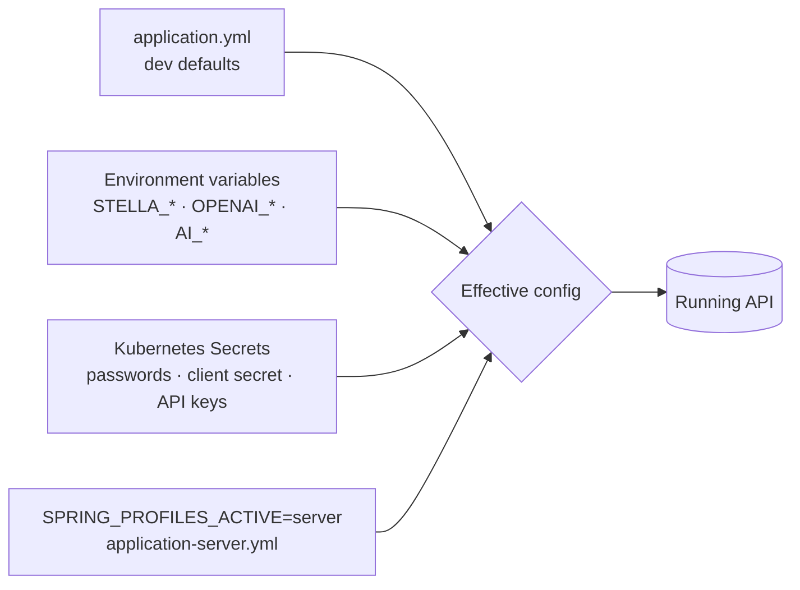

# Configuration Reference

> See also [Local Development](local-development.md), [Deployment](deployment.md) and the
> SDD [Security](sdd/07-security.md) page.

Stella uses Spring configuration with environment-variable overrides. Local defaults are intended for development only.

Precedence: environment variables and the active profile override the `application.yml`
defaults; secrets supply sensitive values in deployed environments.

## Application

| Variable | Default | Description |
| --- | --- | --- |
| `STELLA_DATASOURCE_URL` | `jdbc:postgresql://127.0.0.1:5432/stella` | PostgreSQL JDBC URL |
| `STELLA_DATASOURCE_USERNAME` | `stella` | Application database user |
| `STELLA_DATASOURCE_PASSWORD` | `stella` | Application database password |
| `STELLA_MAX_FILE_SIZE` | `5MB` | Maximum multipart file size |
| `STELLA_MAX_REQUEST_SIZE` | `5MB` | Maximum multipart request size |
| `STELLA_CORS_ALLOWED_ORIGIN_1` | `http://127.0.0.1:4200` | First allowed frontend origin |
| `STELLA_CORS_ALLOWED_ORIGIN_2` | `http://localhost:4200` | Second allowed frontend origin |

## Keycloak

| Variable | Default | Description |
| --- | --- | --- |
| `STELLA_KEYCLOAK_BASE_URL` | `http://127.0.0.1:9080` | Keycloak base URL |
| `STELLA_KEYCLOAK_REALM` | `stella` | Realm used by the application |
| `STELLA_KEYCLOAK_PUBLIC_CLIENT_ID` | `stella-cli` | Public client used by interactive login flows |
| `STELLA_KEYCLOAK_ADMIN_REALM` | `master` | Realm used to obtain admin tokens in local fallback mode |
| `STELLA_KEYCLOAK_ADMIN_CLIENT_ID` | `admin-cli` | Admin client id |
| `STELLA_KEYCLOAK_ADMIN_USERNAME` | `admin` | Local fallback admin username |
| `STELLA_KEYCLOAK_ADMIN_PASSWORD` | `admin` | Local fallback admin password |
| `STELLA_KEYCLOAK_ADMIN_CLIENT_SECRET` | empty | Production confidential client secret |
| `STELLA_GOOGLE_CLIENT_ID` / `STELLA_GOOGLE_CLIENT_SECRET` | empty | Google OAuth app credentials used by the Keycloak broker |
| `STELLA_GITHUB_CLIENT_ID` / `STELLA_GITHUB_CLIENT_SECRET` | empty | GitHub OAuth app credentials used by the Keycloak broker |

In production, configure `STELLA_KEYCLOAK_ADMIN_CLIENT_SECRET` and use a dedicated confidential client with only the required realm-management roles. Social login also requires exposing Keycloak to the browser, registering the Keycloak broker redirect URIs in Google/GitHub, and providing the OAuth app credentials through Kubernetes Secrets. The SPA uses Authorization Code + PKCE for social login and keeps `/api/public/login` plus `/api/public/refresh` for the backend-mediated username/password flow.

## MinIO

| Variable | Default | Description |
| --- | --- | --- |
| `STELLA_MINIO_ENDPOINT` | `http://127.0.0.1:9000` | S3-compatible endpoint |
| `STELLA_MINIO_ACCESS_KEY` | `minioadmin` | MinIO access key |
| `STELLA_MINIO_SECRET_KEY` | `minioadmin` | MinIO secret key |
| `STELLA_MINIO_BUCKET` | `stella-itens` | Bucket for uploaded images |
| `STELLA_MINIO_MAX_IMAGE_SIZE_BYTES` | `5242880` | Maximum accepted image size in bytes |

## OpenAI

| Variable | Default | Description |
| --- | --- | --- |
| `OPENAI_API_KEY` | required for AI features | API key used by backend-only OpenAI integrations |
| `AI_ENABLED` | `true` | Enables or disables AI features before any OpenAI call is attempted |
| `OPENAI_MAX_IMAGES_PER_DAY` | unlimited | Maximum daily OpenAI image-analysis calls |
| `OPENAI_MAX_GENERATIONS_PER_DAY` | unlimited | Maximum daily OpenAI image-generation calls |
| `OPENAI_MAX_EMBEDDINGS_PER_DAY` | unlimited | Maximum daily embedding-generation calls guarded as AI usage |
| `STELLA_OPENAI_MODEL` | `gpt-4.1-mini` | Model used to analyze uploaded inventory photos |
| `STELLA_OPENAI_IMAGE_MODEL` | `gpt-image-1` | Model used to generate product images |
| `STELLA_OPENAI_IMAGE_SIZE` | `1024x1024` | Generated product image size |
| `STELLA_OPENAI_IMAGE_QUALITY` | `low` | Generated product image quality |
| `STELLA_OPENAI_IMAGE_OUTPUT_FORMAT` | `png` | Generated product image format |

When `AI_ENABLED=false`, the API rejects AI operations without calling OpenAI. Daily limits are counted in memory and reset by local date; they are intentionally simple and can later move to database persistence. A limit of `0` blocks that operation type, while an unset or negative limit is treated as unlimited.

Image generation uses `gpt-image-1` by default. If `/api/v0/main-items/image-ai` returns `502` while photo analysis still works, check whether the OpenAI organization is verified and allowed to use the configured image model. When the account does not have access to `gpt-image-1`, set `STELLA_OPENAI_IMAGE_MODEL` to an image model enabled for that organization and redeploy the API.

## Vector Search

| Variable | Default | Description |
| --- | --- | --- |
| `STELLA_VECTOR_SEARCH_ENABLED` | `false` | Enables semantic search and indexing |
| `STELLA_VECTOR_SEARCH_MIN_SIMILARITY` | `0.20` | Minimum similarity accepted in search results |
| `STELLA_VECTOR_SEARCH_MAX_RESULTS` | `12` | Maximum semantic search results |
| `STELLA_EMBEDDINGS_PROVIDER` | `local` | Embeddings provider label stored with indexed vectors |
| `STELLA_EMBEDDINGS_BASE_URL` | `http://stella-embeddings:8000` | OpenAI-compatible embeddings endpoint |
| `STELLA_EMBEDDINGS_MODEL` | `sentence-transformers/paraphrase-multilingual-MiniLM-L12-v2` | 384-dimension model used by pgvector |
| `STELLA_EMBEDDINGS_DIMENSIONS` | `384` | Expected embedding vector size |

The database vector column is `vector(384)`, so changing to a model with different dimensions requires a migration and full reindex.

## Embedding Queue

| Variable | Default | Description |
| --- | --- | --- |
| `STELLA_MESSAGING_ENABLED` | `false` | Enables asynchronous embedding indexing through RabbitMQ and the transactional outbox |
| `STELLA_RABBITMQ_HOST` | `127.0.0.1` | RabbitMQ host |
| `STELLA_RABBITMQ_PORT` | `5672` | AMQP port |
| `STELLA_RABBITMQ_USERNAME` | `stella` | RabbitMQ username; supply it as a secret in production |
| `STELLA_RABBITMQ_PASSWORD` | `stella` | RabbitMQ password; supply it as a secret in production |
| `STELLA_EMBEDDING_EXCHANGE` | `stella.embedding` | Direct exchange for embedding events |
| `STELLA_EMBEDDING_QUEUE` | `stella.embedding.index` | Main indexing queue |
| `STELLA_EMBEDDING_DLQ` | `stella.embedding.index.dlq` | Dead-letter queue after consumer retries are exhausted |
| `STELLA_EMBEDDING_RELAY_BATCH_SIZE` | `50` | Maximum pending outbox events published per relay execution |
| `STELLA_EMBEDDING_RELAY_DELAY_MS` | `1000` | Delay between outbox relay executions |
| `STELLA_EMBEDDING_PUBLISH_MAX_ATTEMPTS` | `10` | Maximum publisher attempts before an outbox event becomes `FAILED` |

When messaging is disabled, Stella retains the synchronous post-commit index update. See [Embedding Messaging](messaging.md) for delivery semantics and operations.

## Logging

| Variable | Default | Description |
| --- | --- | --- |
| `SPRING_PROFILES_ACTIVE` | default profile | Use `server` in Kubernetes deployments |
| `STELLA_ENVIRONMENT` | `server` in server profile | Environment label in structured logs |
| `STELLA_LOG_LEVEL` | `INFO` | Root log level |
| `STELLA_SECURITY_LOG_LEVEL` | `INFO` | Spring Security log level in server profile |

Local logs are human-readable. The `server` profile emits ECS JSON logs to stdout.

## Sensitive Values

Do not commit real secrets to the repository. Production passwords, client secrets, registry credentials and object-storage keys must be delivered through Kubernetes secrets, GitHub Actions secrets, or another secret-management mechanism.
