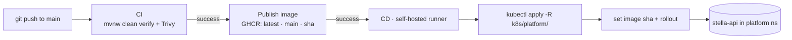

# Kubernetes Deployment

> See also the SDD [Deployment](sdd/08-deployment.md) and [Operations](operations.md).

## Pipeline at a Glance



## Manifests

Kubernetes assets live under `k8s/platform/`:

| Path | Purpose |
| --- | --- |
| `namespaces.yaml` | Platform namespace |
| `postgres/` | PostgreSQL stateful workload and service |
| `keycloak/` | Keycloak deployment, service and realm config |
| `minio/` | MinIO deployment, service and persistent volume claim |
| `stella-embeddings/` | Local text embeddings service used by vector search |
| `observability/` | Grafana datasource/dashboard ConfigMaps plus Prometheus ServiceMonitor and alert rules for the existing Gimli monitoring stack |
| `stella-api/` | Stella API deployment, service, ingress and configuration |

## CI/CD Flow

The repository uses three GitHub Actions workflows:

| Workflow | Responsibility |
| --- | --- |
| `ci.yml` | Runs `./mvnw clean verify` for pushes and pull requests |
| `publish-stella-api.yml` | Builds and publishes the API image to GHCR after CI succeeds on `main` |
| `cd.yml` | Runs a pre-CD backup, applies Kubernetes manifests and updates the API image on the self-hosted k3s runner |

The published image is tagged as `latest`, `main`, and the commit SHA.

The CD workflow requires the Gimli backup environment described in [Backup and Restore](backup.md). A successful pre-CD backup is required before manifests are applied or the API image is changed.

## Applying Manifests Manually

From the repository root:

```bash
sudo k3s kubectl apply -R -f k8s/platform/
```

Update the API image manually:

```bash
sudo k3s kubectl set image deployment/stella-api \
  stella-api=ghcr.io/munifgebara/stella-api:<commit-sha> \
  -n platform
```

Wait for rollout:

```bash
sudo k3s kubectl rollout status deployment/stella-api -n platform --timeout=180s
```

## Required Server Configuration

The API deployment reads non-sensitive values from `stella-api-configmap.yaml` and sensitive values from Kubernetes secrets.

Required production-sensitive values include:

- database credentials
- Keycloak admin client secret
- MinIO credentials
- registry pull secret when using private GHCR images

The server profile is activated with:

```text
SPRING_PROFILES_ACTIVE=server
```

In this profile, logs are emitted as ECS JSON to stdout for collection by the cluster logging stack.

## Post-Deploy Checks

```bash
sudo k3s kubectl get pods -n platform
sudo k3s kubectl rollout status deployment/stella-api -n platform
sudo k3s kubectl logs deployment/stella-api -n platform --tail=50
```

Application checks:

- `/actuator/health` should report healthy readiness for the API.
- `/app` should serve the integrated Angular application.
- `/scalar` should expose the API documentation UI.
- `POST /api/v0/main-items/semantic-search/reindex` should be run after enabling vector search or changing the embeddings model.
