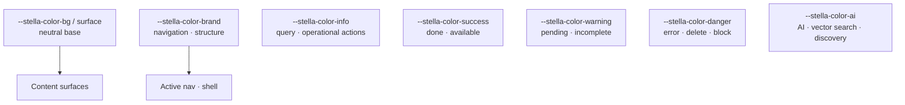

# Stella Frontend Design System

> Scope: the Angular/PrimeNG frontend only. It does not change the backend, API contracts or
> business rules. See also [Architecture](architecture.md).

This document records the visual foundation of the Stella frontend. PrimeNG remains the primary
component library; Stella adds product tokens and classes on top of it.

## Principles

- Operational, clean and predictable interface.
- Neutral base for content, with colour used by **semantic role**.
- AI features (vector search, photo registration) get their own visual treatment and must not
  compete with error, success or warning colours.

## Colour Token Roles

Global tokens live in `frontend/src/styles.css`.

| Token | Role |
| --- | --- |
| `--stella-color-bg` / `--stella-color-surface` / `--stella-color-surface-muted` | Application background, panels/cards, neutral placeholders |
| `--stella-color-border` | Dividers and common borders |
| `--stella-color-text` / `--stella-color-text-muted` | Primary text; subtitles, metadata, auxiliary labels |
| `--stella-color-brand` | Brand, active navigation, structure |
| `--stella-color-info` | Query, information, operational actions |
| `--stella-color-success` | Success, completed, available |
| `--stella-color-warning` | Attention, pending, incomplete |
| `--stella-color-danger` | Error, failure, deletion, blocking |
| `--stella-color-ai` | AI, vector search, suggestions, discovery |

## Colour Rules

- Do not use raw hex in new CSS when an equivalent token exists.
- Do not use green for a generic primary action; green is reserved for success.
- Do not use purple outside AI/discovery.
- Do not use red for ordinary text or light warnings; red is only error, deletion or blocking.
- Colour must not be the only state signal; always pair it with text, icon or label.

## CSS Components

- `.page`: standard vertical screen structure.
- `.page-header`: title, subtitle and primary action.
- `.toolbar` / `.stella-toolbar`: search, filters and secondary actions.
- `.stella-panel`: standard panel with border, surface and light shadow.
- `.stella-card`: simple card for repeated content.
- `.stella-ai-panel`: block for AI, vector search, photo registration and suggestions.
- `.error-box`, `.success-box`: standardized state messages.
- `.stella-state--info|warning|error|success`: additional semantic states.

## Recommended Next Steps

- Migrate remaining local CSS to tokens as screens change.
- Extract shared Angular components if the same patterns keep repeating.
- Review long-list mobile views with dedicated cards (items and instances).
- Consider a dark mode only after the token migration is complete.
