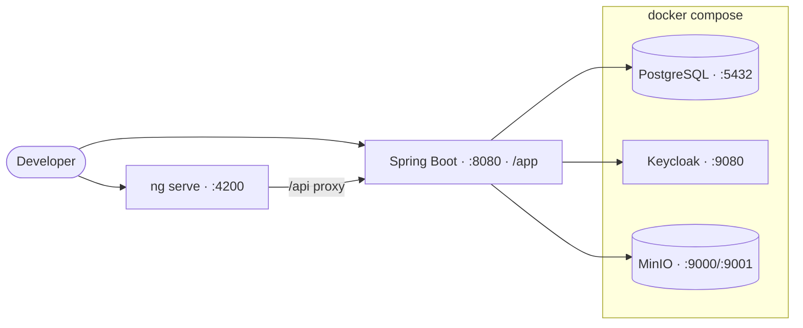

# Local Development

> See also [Configuration](configuration.md), [Testing](testing.md) and the full
> [Build From Scratch guide](build-from-scratch/README.md).

## Local Topology



## Prerequisites

- Java 25
- Docker and Docker Compose
- Maven Wrapper from this repository
- Node.js 22+ and npm if running the Angular development server directly

## Start Local Infrastructure

```bash
docker compose up -d
```

This starts:

| Service | Local URL |
| --- | --- |
| PostgreSQL | `127.0.0.1:5432` |
| Keycloak | `http://127.0.0.1:9080` |
| MinIO API | `http://127.0.0.1:9000` |
| MinIO Console | `http://127.0.0.1:9001` |

The Keycloak realm is imported from `keycloak/realm/` during local startup.

## Run the Backend

```bash
./mvnw spring-boot:run
```

The API runs at `http://127.0.0.1:8080`.

Useful URLs:

- Application: `http://127.0.0.1:8080/app`
- API base: `http://127.0.0.1:8080/api`
- Scalar API UI: `http://127.0.0.1:8080/scalar`
- Health: `http://127.0.0.1:8080/actuator/health`
- Prometheus metrics: `http://127.0.0.1:8080/actuator/prometheus`

## Run the Frontend Dev Server

```bash
cd frontend
npm install
npm start
```

The Angular development server runs at `http://127.0.0.1:4200`.

## Build the Integrated Application

```bash
./mvnw clean verify
```

The Maven build installs frontend dependencies, runs the Angular production build, compiles the backend, executes tests, checks JaCoCo coverage, and packages the application.

## Reset Prototype Data

The Stella database schema starts from a clean Flyway checkpoint in English. During the prototype phase, operational data is disposable.

When recreating a local or shared prototype environment after schema changes, reset both stores:

- Drop and recreate the Stella PostgreSQL database/schema.
- Delete Stella image objects from MinIO or the equivalent local bucket.

Keycloak users and authentication data are external to the Stella operational schema and must not be deleted as part of this reset.

## Local Demo Access

Local Keycloak admin credentials:

- username: `admin`
- password: `admin123`

Realm users imported for local/demo use:

- `admin`
- `proprietario`
- `usuario`

Do not reuse local credentials in production.
