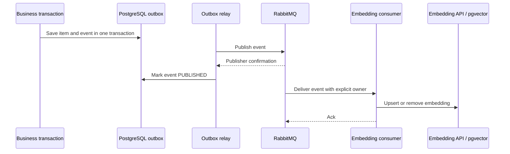

# Embedding Messaging

Stella can update semantic-search embeddings asynchronously with RabbitMQ. The feature is disabled by default so local installations can keep the existing synchronous post-commit behavior.

## Delivery Flow

The outbox prevents a committed item change from being lost when RabbitMQ is unavailable. Publication is at least once: a crash between broker confirmation and the outbox status update can publish the same event again. Processing is idempotent because upserts replace the embedding for the item identifier and removals tolerate an already-absent embedding.

Every event carries `ownerEmail` and `ownerIssuer`. The consumer passes both values to an owner-scoped repository query explicitly; processing therefore does not depend on an HTTP request, `ThreadLocal`, or ambient worker-thread state.

## Failure Handling

Publisher confirms are required before an outbox event becomes `PUBLISHED`. Failed publications remain pending and become `FAILED` after the configured maximum attempts.

Consumer failures use exponential retry configured by Spring AMQP. After retries are exhausted, RabbitMQ rejects the message and routes it through `stella.embedding.dlx` to `stella.embedding.index.dlq`. Operators must diagnose and replay DLQ messages explicitly; silent automatic replay could create an endless poison-message loop.

## Eventual Consistency

With messaging enabled, item writes return after the database transaction commits, not after vector generation. Semantic-search results can therefore lag briefly behind CRUD operations. Normal item listing and lookup continue to use PostgreSQL and are immediately consistent.

Use `POST /api/v0/main-items/semantic-search/reindex` to enqueue all active items after enabling vector search or changing the embedding model.
