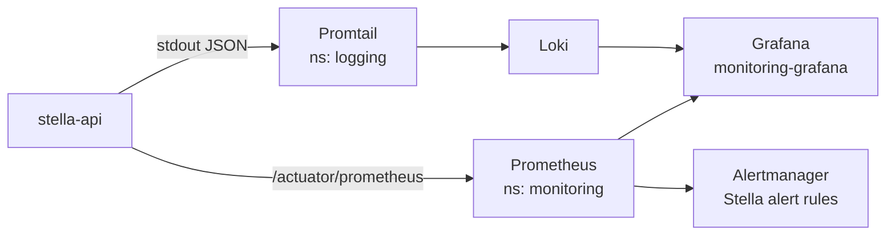

# Operations

> See also [Deployment](deployment.md), [Backup and Restore](backup.md) and the SDD
> [Observability](sdd/09-observability.md) page.

## Observability at a Glance



## Health and Metrics

Useful API endpoints:

- `/actuator/health`
- `/actuator/metrics`
- `/actuator/prometheus`
- `/scalar`

In Kubernetes, start with:

```bash
sudo k3s kubectl get pods -n platform
sudo k3s kubectl describe pod -n platform -l app=stella-api
sudo k3s kubectl logs deployment/stella-api -n platform --tail=100
```

## Logs

Local runs use readable console logs. Kubernetes runs should use the `server` profile, which writes ECS JSON logs to stdout.

Stella does not push logs directly to Grafana. The expected production path is:

```text
Stella pod stdout -> cluster log collector -> Loki or equivalent -> Grafana
```

Valid collectors include Grafana Alloy, Promtail, Fluent Bit, or another Kubernetes log collector.

Gimli already runs the logging stack outside the Stella platform manifests:

- Grafana: namespace `monitoring`, service `monitoring-grafana`
- Loki: namespace `logging`, service `loki`
- Promtail: namespace `logging`, daemonset `promtail`

The Stella repository does not deploy Grafana, Loki, or Promtail. The manifests under `k8s/platform/observability/` only add Grafana sidecar ConfigMaps for the existing stack:

- `stella-loki-datasource`: adds datasource `Stella Loki`
- `stella-logs-dashboard`: adds dashboard `Stella Logs`
- `stella-api`: adds a Prometheus `ServiceMonitor` for `/actuator/prometheus`
- `stella-api-alerts`: adds Prometheus alert rules for the Stella API target, pod restarts, 5xx rate and JVM heap usage

Apply or reapply the platform manifests:

```bash
sudo k3s kubectl apply -R -f k8s/platform/
```

Check the existing logging stack:

```bash
sudo k3s kubectl get pods -n platform -l app.kubernetes.io/part-of=stella
sudo k3s kubectl rollout status deployment/monitoring-grafana -n monitoring --timeout=180s
sudo k3s kubectl rollout status statefulset/loki -n logging --timeout=180s
sudo k3s kubectl rollout status daemonset/promtail -n logging --timeout=180s
```

The datasource is provisioned through the Grafana sidecar with:

```text
Name: Stella Loki
Type: Loki
URL:  http://loki.logging.svc.cluster.local:3100
```

If Grafana runs outside the k3s cluster network, access Loki temporarily through port-forward while configuring or testing it:

```bash
sudo k3s kubectl port-forward svc/loki -n logging 3100:3100
```

Then use `http://localhost:3100` as the temporary datasource URL.
Do not expose Grafana or Loki publicly without authentication.

The existing Promtail daemonset collects Kubernetes pod logs. Useful labels for Stella queries are:

- `namespace`
- `pod`
- `container`
- `app`
- `app_kubernetes_io_name`
- `app_kubernetes_io_component`
- `app_kubernetes_io_part_of`

Stella API logs use ECS JSON. Use LogQL JSON parsing for fields such as:

- `level`
- `event_category`
- `event_action`

Kubernetes label names containing dots or slashes are normalized with underscores because Loki label names do not support those characters.

Useful LogQL queries:

```logql
{namespace="platform", app="stella-api"}
```

```logql
{namespace="platform", app="stella-api"} | json | log_level="ERROR"
```

```logql
{namespace="platform", app="stella-api"} |= "/api/v0/itens-mestre/imagem-ia"
```

```logql
{namespace="platform", app="stella-api"} |= "/api/v0/ia/cadastro-foto/sugestoes"
```

```logql
{namespace="platform", app="stella-api"} |= "OpenAI"
```

```logql
{namespace="platform", app="stella-api"} |= "MinIO"
```

```logql
{namespace="platform", app="stella-api"} |= "Keycloak"
```

```logql
{namespace="platform", app="stella-api"} | json | event_category="ai"
```

```logql
{namespace="platform", app="stella-api"} | json | event_category="vector-search"
```

```logql
{namespace="platform", pod=~".+"}
```

## Alerts

The Gimli monitoring stack loads Stella alert rules through the Prometheus Operator. The repository provides:

```bash
k8s/platform/observability/stella-api-servicemonitor.yaml
k8s/platform/observability/stella-api-prometheus-rules.yaml
```

Prometheus selects these rules through the `release: monitoring` label. The current rules cover:

- `StellaApiTargetDown`: Prometheus cannot scrape the Stella API target.
- `StellaApiPodRestarting`: the Stella API container restarted more than twice in 10 minutes.
- `StellaApiHigh5xxRate`: more than 5% of API requests returned 5xx for 5 minutes.
- `StellaApiHighJvmHeapUsage`: JVM heap usage stayed above 80% for 5 minutes.

Grafana currently has sidecars for dashboards and datasources, not alert provisioning. Log-only checks such as AI daily-limit blocks and vector-search failures should be investigated with the LogQL queries above until a Loki ruler or Grafana alert provisioning path is added to the monitoring stack.

To inspect restart-related logs, start with the pod list and then query by pod name:

```bash
sudo k3s kubectl get pods -n platform
```

```logql
{namespace="platform", pod="<pod-name>"}
```

Avoid logging:

- tokens
- passwords
- client secrets
- full personal-data payloads
- SQL bind values in production

## Common Checks

Check the deployed image:

```bash
sudo k3s kubectl get deployment stella-api -n platform \
  -o jsonpath='{.spec.template.spec.containers[0].image}'
```

Check API configuration values from the ConfigMap:

```bash
sudo k3s kubectl get configmap stella-api-config -n platform -o yaml
```

Check rollout history:

```bash
sudo k3s kubectl rollout history deployment/stella-api -n platform
```

## Backup Notes

Backups are documented in [Backup and Restore](backup.md). The Gimli setup must support:

- full backup to a configured rclone remote, initially Google Drive
- encrypted Kubernetes secrets
- PostgreSQL-only restore
- MinIO-only restore
- Kubernetes resources and secrets restore
- daily scheduled backup
- pre-CD backup before any production deployment change
