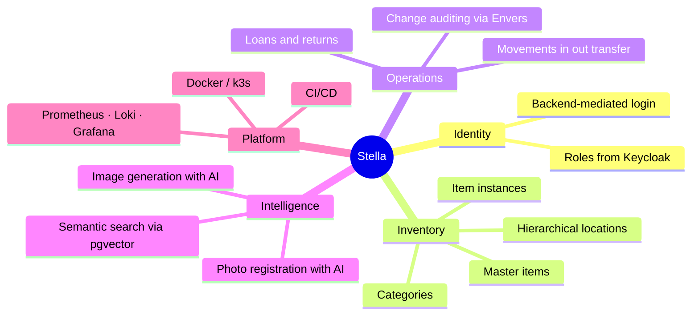

# System Overview

> Part of the [Software Design Document](README.md). See also [Introduction](01-introduction.md)
> and [Architecture](03-architecture.md).

## Product Context

Stella manages a personal inventory: a catalog of master items, the physical instances of those
items, where they are stored, how they move, and who borrows them — enriched with images,
AI-assisted registration and semantic search.

## Main Capabilities

- Authenticate users through Keycloak.
- Protect frontend routes and backend APIs with OAuth2/OIDC.
- Manage people and inventory-related entities.
- Store relational application state in PostgreSQL.
- Store item and location images in MinIO.
- Expose health and metrics through Spring Boot Actuator.
- Build and deploy through GitHub Actions and Kubernetes manifests.

## User Profiles

| Profile | Description |
| --- | --- |
| Administrator | Manages users, configuration and operational access. |
| Inventory owner | Maintains inventory items, locations and related images. |
| Basic user | Consults allowed inventory information and supported workflows. |

## Modules

| Module | Status | Notes |
| --- | --- | --- |
| Authentication | Implemented | Keycloak realm, backend-mediated login, role mapping. |
| Inventory catalog | Implemented | Categories, master items, instances, hierarchical locations, images. |
| Movements & loans | Implemented | Inbound/outbound/transfer movements; loans and returns. |
| AI registration & images | Implemented | OpenAI vision for photo registration and image generation. |
| Semantic search | Implemented | pgvector + local embeddings; enabled in the server environment. |
| Change auditing | Implemented | Hibernate Envers history on all business entities. |
| Observability | Implemented | Prometheus metrics, Loki logs, Grafana dashboards and alerts. |
| Per-user data ownership | Planned | Horizontal authorization; DB slot reserved — see [Data Model](05-data-model.md#data-ownership-planned). |

## Product Boundaries

Stella owns inventory application data and orchestration of its integrations. It does not own identity storage, object storage internals, log aggregation infrastructure, or external LLM model behavior.
