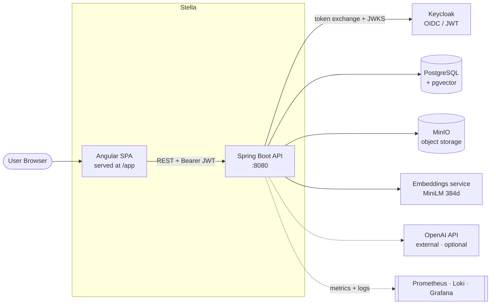
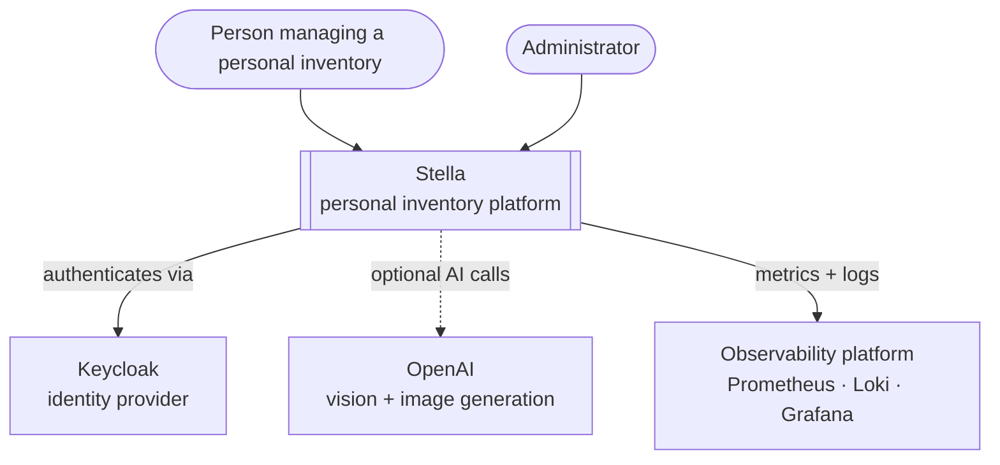
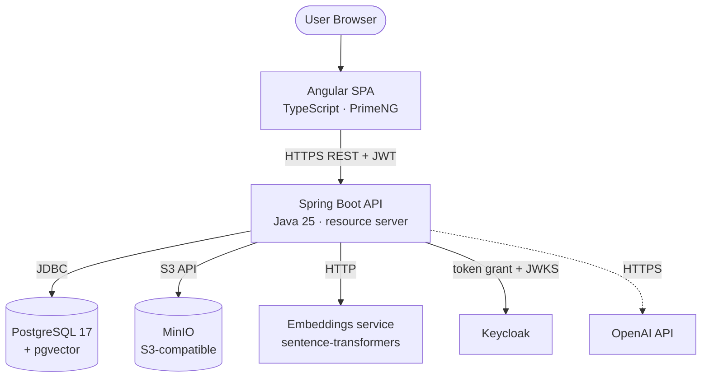

# Architecture

> Part of the [Software Design Document](README.md). See also the official
> [Architecture guide](../architecture.md) and the
> [Build From Scratch guide](../build-from-scratch/README.md).

## High-Level View

Stella is a full-stack web application: an Angular single-page application (SPA) is served by,
and talks **only to**, a secured Spring Boot API. The API is the single integration point for
PostgreSQL, MinIO, Keycloak, the embeddings service and OpenAI.

> **Important:** the SPA never contacts Keycloak directly. Authentication is *backend-mediated*
> (see [Security](07-security.md)).

## Architectural Style

The backend follows conventional Spring layering:

- controllers expose HTTP endpoints (`/api/v0/...`, plus `/api/public/...` for unauthenticated reads and login)
- services coordinate business rules and integrations
- repositories access persistence; a shared `SuperRepository`/`SuperService` base centralizes CRUD, soft delete and audit-history queries
- DTOs define API contracts (entities are never exposed directly)
- configuration classes isolate framework and integration setup

The frontend is an Angular application organized around routed screens, a core auth/i18n layer,
services and reusable design-system components.

## C4 — Context

## C4 — Container

## Technology Baseline

| Area | Technology |
| --- | --- |
| Backend | Java 25, Spring Boot 4, Spring Security, Spring Data JPA, Flyway, Hibernate Envers |
| Frontend | Angular 21, TypeScript, PrimeNG, custom design system |
| Identity | Keycloak, OAuth2, OpenID Connect, JWT (backend-mediated password grant) |
| Data | PostgreSQL 17 with pgvector |
| Object storage | MinIO |
| AI | OpenAI (vision + image generation); local embeddings sidecar (MiniLM, 384 dims) — implemented |
| Deployment | Docker, Kubernetes (k3s), GitHub Actions, GHCR, Cloudflare Tunnel + Traefik ingress |
| Observability | Actuator/Micrometer, kube-prometheus-stack, Loki + Promtail, Grafana dashboards and alerts |

## Diagram Guidance

Use Mermaid for all diagrams so they render directly on GitHub. Keep diagrams close to the
implemented system and update them in the same pull request that changes the design.
