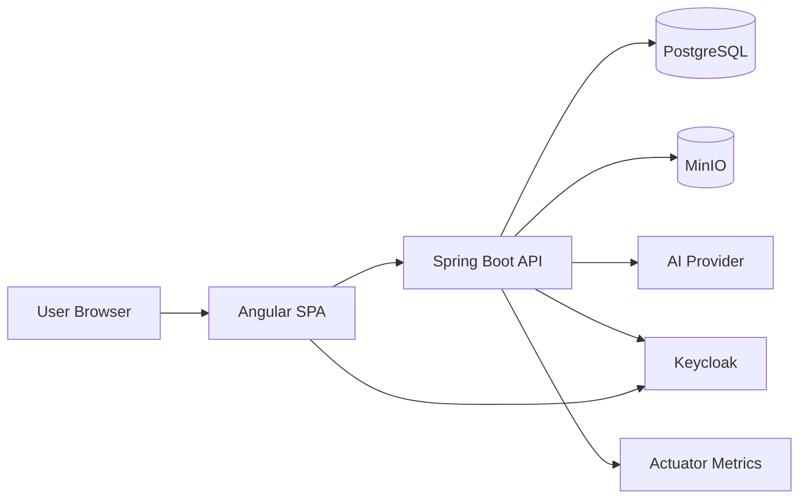
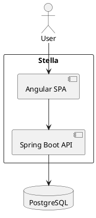

# Architecture

## High-Level View

Stella is a full-stack web application with an Angular single-page application served alongside a secured Spring Boot API. The API integrates with PostgreSQL, MinIO, Keycloak and selected AI providers.

## Architectural Style

The backend follows conventional Spring layering:

- controllers expose HTTP endpoints
- services coordinate business rules and integrations
- repositories access persistence
- DTOs define API contracts
- configuration classes isolate framework and integration setup

The frontend is an Angular application organized around routed screens, services and reusable UI components.

## C4 Starting Point

| Level | Initial Scope |
| --- | --- |
| Context | Stella, users, Keycloak, PostgreSQL, MinIO, AI providers and observability platform. |
| Container | Angular SPA, Spring Boot API, PostgreSQL, MinIO, Keycloak and Kubernetes workloads. |
| Component | Backend controllers, services, repositories, providers and frontend feature modules. |
| Code | Class-level and function-level design should stay close to source code and tests. |

## Technology Baseline

| Area | Technology |
| --- | --- |
| Backend | Java, Spring Boot, Spring Security, Spring Data JPA, Flyway |
| Frontend | Angular, TypeScript, PrimeNG |
| Identity | Keycloak, OAuth2, OpenID Connect, JWT |
| Data | PostgreSQL |
| Object storage | MinIO |
| AI | OpenAI integration today; local embeddings are planned |
| Deployment | Docker, Kubernetes/K3S, GitHub Actions |
| Observability | Actuator, Micrometer, Prometheus-ready metrics, structured logs |

## Diagram Guidance

Use Mermaid for diagrams that should render directly in GitHub. PlantUML may be added for detailed component, sequence or deployment diagrams when needed.

