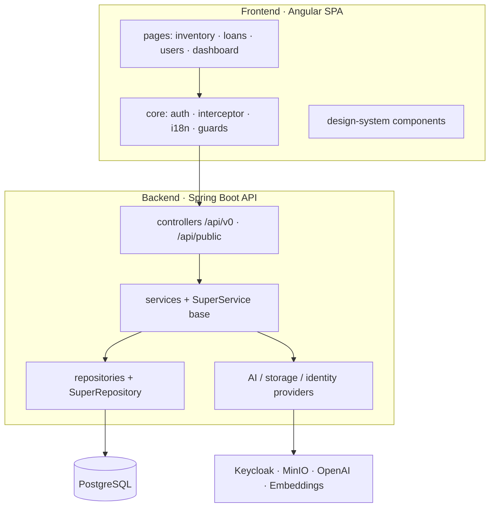

# Components

> Part of the [Software Design Document](README.md). See also [Architecture](03-architecture.md).

## Backend

The backend is a Spring Boot API responsible for:

- HTTP API endpoints
- validation and error handling
- business rules
- persistence orchestration
- authentication and authorization enforcement
- integration with Keycloak, MinIO and AI providers

## Frontend

The frontend is an Angular SPA responsible for:

- authenticated user experience
- route protection
- inventory and administration screens
- REST API consumption
- client-side form validation and feedback

## AI Services

AI services are exposed through backend provider abstractions. The current design should keep provider-specific details outside controllers and preserve clear failure behavior when an external AI service is unavailable.

## Agents

Agentic workflows are planned. Initial design records should describe:

- agent responsibilities
- allowed tools and APIs
- human approval points
- logging and audit expectations
- guardrails and cost limits

## External Integrations

| Integration | Purpose |
| --- | --- |
| Keycloak | Authentication, users, roles and token issuance. |
| MinIO | S3-compatible image storage. |
| OpenAI | Image analysis, image generation and future AI features. |
| GitHub Actions | CI, image publication and deployment automation. |

## Auxiliary Services

| Service | Purpose |
| --- | --- |
| PostgreSQL | Relational persistence with the pgvector extension for semantic search. |
| stella-embeddings | Local sidecar turning text into 384-dim vectors (MiniLM). |
| Kubernetes/k3s | Runtime platform for server deployment. |
| Grafana + Loki + Promtail | Log aggregation and visualization (deployed). |
| Prometheus | Scrapes actuator metrics via a ServiceMonitor; drives alerts. |
