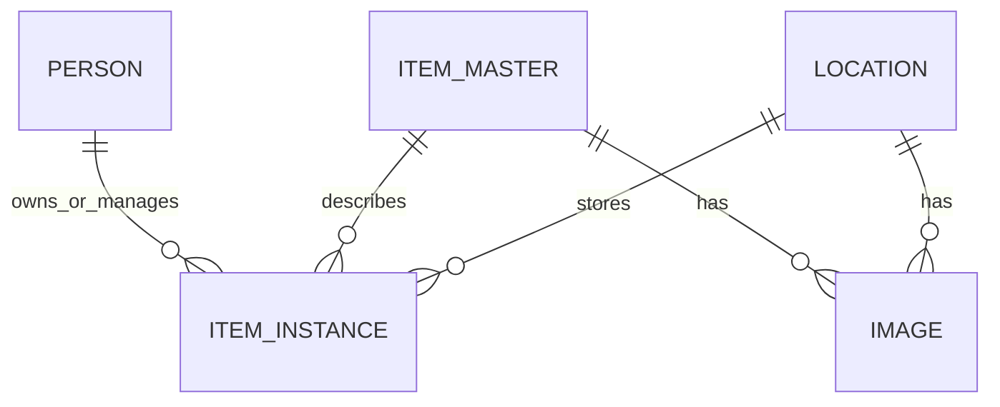

# Data Model

## Conceptual Model

The data model centers on personal inventory management. It should represent people, users, item master data, item instances, locations, images and operational events.

## Main Entities

| Entity | Responsibility |
| --- | --- |
| Person | Application-level person registration and related attributes. |
| User | Identity-backed actor authenticated through Keycloak. |
| Item master | Shared catalog description for similar inventory items. |
| Item instance | Concrete inventory unit with lifecycle state. |
| Location | Place where items can be stored or managed. |
| Image | Metadata and object-storage reference for uploaded or generated images. |

## Persistence Strategy

- PostgreSQL is the system of record for relational state.
- Flyway migrations version schema changes.
- MinIO stores binary image content; PostgreSQL stores metadata and object keys.
- Future vector search should keep embeddings synchronized with item data changes.

## PostgreSQL Notes

PostgreSQL should remain the default durable store. If pgvector is adopted, vector columns and indexes should be introduced through Flyway migrations and documented here with update rules, indexing strategy and fallback behavior.

## Open Questions

- Which entities require audit history beyond existing timestamps?
- Which item fields are part of semantic search documents?
- Should vectors live in the main schema or in a dedicated search schema?
