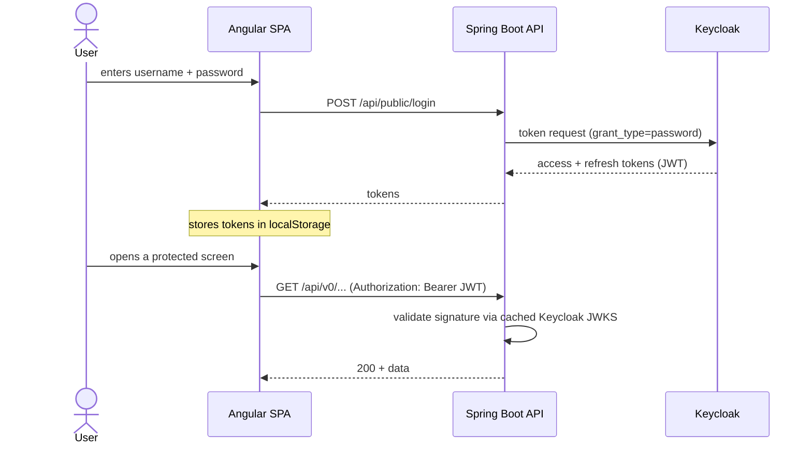

# Security

> Part of the [Software Design Document](README.md). See also
> [Architecture](03-architecture.md) and the [Configuration reference](../configuration.md).

## Authentication

Stella uses Keycloak as the identity provider. Authentication is **backend-mediated**: the SPA
never contacts Keycloak directly. The frontend posts the user's credentials to
`POST /api/public/login`, the API exchanges them with Keycloak using the OAuth2 password grant
and relays the resulting tokens back to the SPA, which stores them in `localStorage`. Every
later request to `/api/v0/**` carries the access token as a Bearer header; an Angular HTTP
interceptor attaches it automatically. The backend validates the JWT signature on each request
as a resource server, against the configured issuer's public keys (JWKS).

> Note: the password grant keeps the integration simple and didactic but is not the recommended
> browser flow for production. A future evolution may move to the Authorization Code flow with
> PKCE, where the browser is redirected to Keycloak directly.

## Authorization

Authorization is enforced on the backend; Angular route guards only improve UX and are not a
security boundary. Current rules, as implemented:

- `/api/public/**` — open (login and public image reads).
- `/api/v0/**` — requires a valid JWT (`authenticated()`).
- `/api/v0/users/**` administrative operations — restricted with `@PreAuthorize("hasRole('admin')")`.
- Domain resources (items, instances, loans, locations, people) — currently **authenticated-only**,
  with no per-user ownership check. This is the single-tenant gap tracked by the planned
  [per-user data ownership](05-data-model.md#data-ownership-planned) feature.

Roles come from the Keycloak realm and are mapped from the `realm_access.roles` JWT claim by a
custom converter.

## Keycloak Integration

Keycloak owns users, credentials, realm configuration and token issuance. Production user-management operations should use a dedicated confidential client with the minimum required service-account roles.

## JWT, OAuth2 and OIDC

The backend trusts tokens only from the configured issuer. Token claims used for authorization should be documented when role and permission mapping becomes stable.

## Audit

Security-sensitive operations should be auditable. The audit strategy should define what is logged, where it is stored and how personal data is protected.

## LGPD

Design changes involving personal data should consider:

- data minimization
- purpose limitation
- retention
- access control
- deletion or anonymization needs

## OWASP Top 10

Security reviews should explicitly consider common risks such as broken access control, injection, insecure design, vulnerable dependencies, authentication failures and security logging gaps.

## Secrets

Secrets must not be committed to the repository. Runtime secrets should come from environment variables, Kubernetes Secrets or equivalent platform mechanisms.
