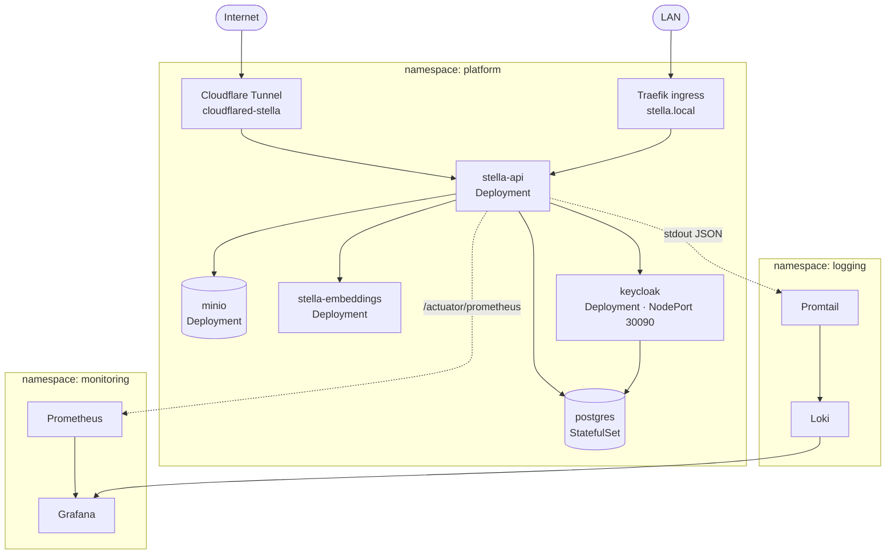

# Deployment

> Part of the [Software Design Document](README.md). See also the official
> [Kubernetes Deployment guide](../deployment.md) and [Operations](../operations.md).

## Environments

| Environment | Purpose |
| --- | --- |
| Local | Developer machine with Docker Compose and local defaults. |
| CI | GitHub Actions build, test and image publishing. |
| Server (Gimli) | Single-node k3s cluster running the `server` profile. |

## Topology (as deployed on the k3s server)

All Stella workloads run in the `platform` namespace. External traffic reaches the API through a
Cloudflare Tunnel and the Traefik ingress (`stella.local`). Observability runs in dedicated
namespaces (`monitoring`, `logging`).

## Manifests

Kubernetes manifests live under `k8s/platform/`, grouped by component: `namespaces.yaml`,
`postgres/`, `keycloak/`, `minio/`, `stella-embeddings/`, `stella-api/` and `observability/`
(Grafana datasource/dashboard ConfigMaps, a Prometheus ServiceMonitor and alert rules).

## Data Stores

- **PostgreSQL** (StatefulSet) is the durable relational store, with pgvector enabled for
  semantic search. Backup/restore is covered in [Backup and Restore](../backup.md).
- **MinIO** (Deployment + PVC) stores item/location/person images; the API creates the bucket on
  first upload.

## ConfigMaps and Secrets

- ConfigMaps (`stella-api-config`) hold non-sensitive runtime values such as URLs, the embeddings
  endpoint and feature flags (`STELLA_VECTOR_SEARCH_ENABLED=true` in the server environment).
- Secrets hold database credentials, the Keycloak admin client secret, MinIO credentials and the
  OpenAI API key.

## CI/CD

GitHub Actions runs verification, publishes the container image to GHCR (tagged `latest`, `main`
and the commit SHA) and the self-hosted runner applies the manifests and rolls out the new image.
See the [CI/CD flow](../deployment.md#cicd-flow) and operational checks in [Operations](../operations.md).
