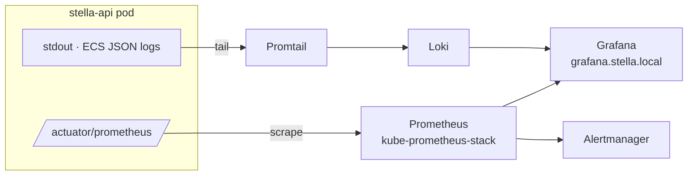

# Observability

> Part of the [Software Design Document](README.md). See also the official
> [Operations guide](../operations.md).

## Stack (as deployed)

Metrics and logs are collected by a standard Kubernetes observability stack and visualized in
Grafana. Alert rules and a ServiceMonitor for the API ship as manifests under
`k8s/platform/observability/`.

## Logs

Local runs use human-readable console logs. With `SPRING_PROFILES_ACTIVE=server`, the API emits
**structured ECS JSON** to stdout. Promtail tails the pod logs into Loki, queried in Grafana.
Business events (login, AI usage, security denials) are emitted through a structured logger.

## Metrics

Spring Boot Actuator + Micrometer expose Prometheus metrics at `/actuator/prometheus`. A
`ServiceMonitor` registers the API as a scrape target for the kube-prometheus-stack Prometheus.

## Alerts

Alert rules ship as `PrometheusRule` manifests (`stella-api-prometheus-rules.yaml`) and are
evaluated by Prometheus/Alertmanager. Rules focus on user-facing impact (availability, error
rate, latency) rather than noisy internals.

## Dashboards

Grafana datasource and dashboard ConfigMaps are versioned in the repository, including a Stella
logs dashboard wired to the Loki datasource.

## Tracing (future)

Distributed tracing is not yet enabled. A future design should define trace propagation,
sampling and correlation IDs (candidate: OpenTelemetry) before cross-service workflows grow.
