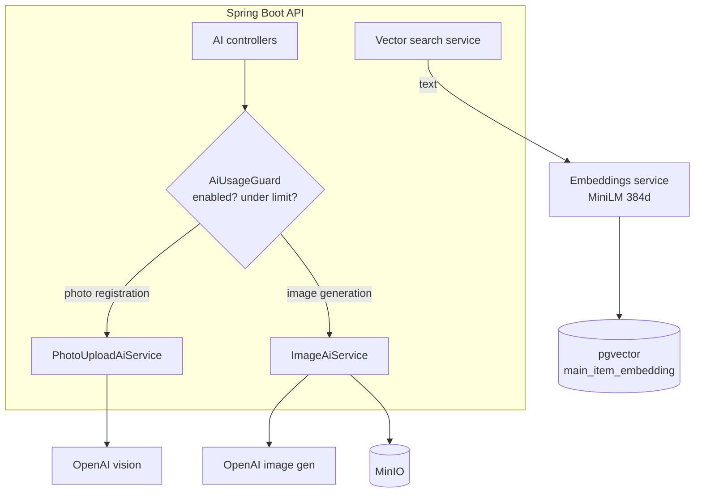

# AI and RAG

> Part of the [Software Design Document](README.md). See also the
> [Build From Scratch guide](../build-from-scratch/README.md) and [Configuration](../configuration.md).

## AI Architecture

AI features are accessed through backend provider abstractions; controllers never depend on
external model SDKs or provider-specific payloads. A central `AiUsageGuard` enforces the master
switch (`AI_ENABLED`) and per-operation daily limits before any external call.

## LLM Integration (OpenAI)

Two OpenAI-backed flows are implemented: **registration from a photo** (vision analysis returns
suggested item fields) and **AI image generation** for catalog items. External calls have
explicit timeouts and error handling, surface typed exceptions, and are gated by `AiUsageGuard`.

> Known limitation: the usage guard keeps counters in memory, so daily limits are per-replica.
> Making them global is tracked in the backlog.

## Embeddings and Vectorization

Semantic search uses a **local embeddings sidecar** (`stella-embeddings`, model
`paraphrase-multilingual-MiniLM-L12-v2`, **384 dimensions**), not a paid API. A document is built
from item fields, embedded, and stored in `main_item_embedding` (a `pgvector` column). Embeddings
are kept in sync as items change, and a reindex endpoint
(`POST /api/v0/main-items/semantic-search/reindex`) rebuilds them after a model or data change.

## RAG (future)

Retrieval today powers semantic search (find similar items). A future RAG design — answering
natural-language questions over the inventory — should define retrievable document types,
chunking, ranking, prompt assembly, source attribution and low-confidence fallback.

## Agents

Agent workflows (for development and operations) should keep clear boundaries: what may be read,
what may be changed, which operations need human approval, how actions are logged and how tool
failures are surfaced. See the agent-assisted path in the
[Build From Scratch guide](../build-from-scratch/en.md#9-the-agent-assisted-path).

## Prompts and Evaluation

Prompts that affect product behavior should be versioned in code and must never embed secrets.
Future AI evaluation should include representative examples, failure cases and regression tests
where deterministic assertions are practical.
