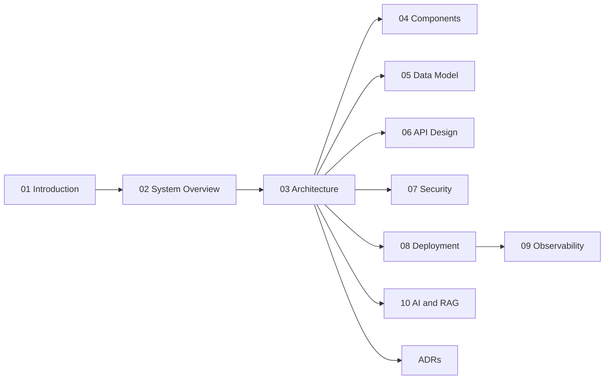

# Stella Software Design Document

This directory contains the Software Design Document (SDD) for Stella. It records the intended technical design of the system and gives future changes a stable place for architecture, data, API, security, deployment, observability, AI and decision records.

The SDD complements the official guides in `docs/`. Those guides explain how to develop, configure, deploy and operate Stella. This SDD explains why the system is structured the way it is and where the design is expected to evolve.

## Navigation

- [Introduction](01-introduction.md)
- [System Overview](02-system-overview.md)
- [Architecture](03-architecture.md)
- [Components](04-components.md)
- [Data Model](05-data-model.md)
- [API Design](06-api-design.md)
- [Security](07-security.md)
- [Deployment](08-deployment.md)
- [Observability](09-observability.md)
- [AI and RAG](10-ai-and-rag.md)
- [Architecture Decisions](decisions/README.md)

## Conventions

- Keep documents in Markdown and use relative links.
- Prefer short sections that can evolve incrementally.
- Use Mermaid for lightweight diagrams embedded in Markdown.
- Use PlantUML only when a diagram needs more detail than Mermaid can express clearly.
- Record durable technical decisions in `decisions/`.
- Do not include secrets, tokens, real credentials or personal data samples.

## Contributing

When changing the design of Stella, update the affected SDD page in the same pull request when practical. If the change introduces a meaningful architectural decision, add a new ADR-lite entry under `decisions/`.

Each page starts as a lightweight template. Expand sections with concrete design information as the implementation becomes stable.
