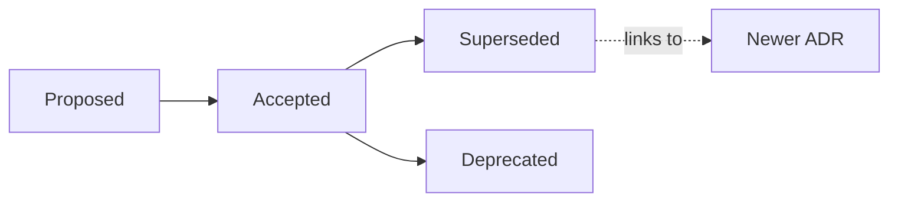

# Architecture Decisions

> Part of the [Software Design Document](../README.md).

This directory stores Stella architecture decision records using a lightweight ADR format.

Use an ADR-lite entry when a decision is durable, costly to reverse, or important for future contributors to understand. Small implementation details can stay in code comments, tests or pull request descriptions.



## Naming

Use numbered Markdown files:

```text
0001-short-decision-title.md
0002-another-decision.md
```

## Template

```markdown
# ADR 0001: Decision Title

## Status

Proposed | Accepted | Superseded

## Context

What problem, constraint or trade-off led to this decision?

## Decision

What was decided?

## Consequences

What improves, what gets harder and what follow-up work is needed?

## References

- Related issue, pull request, document or external reference.
```

## Guidance

- Keep entries short and specific.
- Prefer documenting the trade-off over defending the decision.
- Link related issues and pull requests.
- Update status instead of rewriting history when a decision changes.
