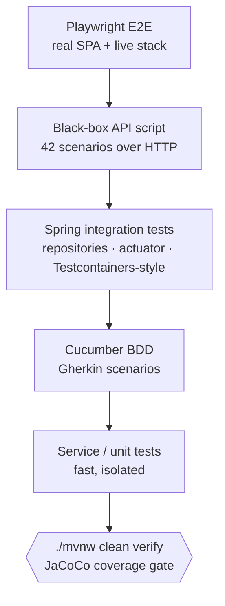

# Testing and Quality

> See also [Local Development](local-development.md) and the SDD pages.

## Test Layers



The gate `./mvnw clean verify` runs unit, BDD and integration tests and enforces coverage; the
black-box script and Playwright E2E run against a live stack.

## Main Verification Command

```bash
./mvnw clean verify
```

This command is the default backend verification gate. It runs the frontend build integrated into Maven, compiles the backend, executes tests, generates the JaCoCo report, checks configured coverage thresholds, and packages the application.

## Focused Test Commands

Run a single test class:

```bash
./mvnw -Dtest=PersonServiceTest test
```

Run the Cucumber BDD suite:

```bash
./mvnw -Dtest=CucumberBddTest test
```

Generate JaCoCo reports:

```bash
./mvnw jacoco:report
```

Check JaCoCo thresholds:

```bash
./mvnw jacoco:check
```

## Black-Box API Regression Test

Run the API smoke/regression test against a live Stella API without importing backend classes:

```bash
STELLA_API_BASE_URL=http://localhost:8080 \
STELLA_API_USERNAME=admin \
STELLA_API_PASSWORD=admin123 \
./scripts/api-blackbox-test.sh
```

The same script can point to the validation environment:

```bash
STELLA_API_BASE_URL=https://stella.gebaralabs.dev \
STELLA_API_USERNAME=admin \
STELLA_API_PASSWORD=admin123 \
./scripts/api-blackbox-test.sh
```

If a token is already available, use it instead of username/password:

```bash
STELLA_API_BASE_URL=http://localhost:8080 \
STELLA_API_TOKEN='ey...' \
./scripts/api-blackbox-test.sh
```

The script requires `curl` and `python3`. It exercises HTTP scenarios against the (English) API: health, authentication (valid/invalid, 401 without token), `users/me`, full CRUD for main items, categories, storage locations, item instances and people (create, lookup, list, search/filter, update, revision history), instance history, duplicate tax-id conflict (409), dashboard summary, the error-handling contract (404 unknown route, 405 wrong method), optional AI flows, optional semantic search, and cleanup. Any resource created by the test is deleted at the end through a shell trap whenever possible.

Configuration:

- `STELLA_API_BASE_URL`: target API base URL. Defaults to `http://localhost:8080`.
- `STELLA_API_PREFIX`: API prefix. Defaults to `/api/v0`.
- `STELLA_API_TOKEN`: bearer token for authenticated endpoints.
- `STELLA_API_USERNAME` and `STELLA_API_PASSWORD`: credentials used with `/api/public/login` when no token is provided.
- `STELLA_RUN_SEMANTIC_SEARCH`: set to `false` to skip semantic search. Defaults to `true`.
- `STELLA_RUN_REINDEX`: set to `true` to call semantic reindexing before semantic search. Defaults to `false`.
- `STELLA_RUN_PHOTO_REGISTRATION`: set to `false` to skip OpenAI photo registration suggestions. Defaults to `true`.
- `STELLA_RUN_IMAGE_AI`: set to `true` to call `POST /api/v0/main-items/image-ai`. Defaults to `false` because it consumes OpenAI image-generation quota and requires access to the configured image model.
- `STELLA_IMAGE_AI_EXPECTED_STATUS`: expected HTTP status for the image generation call. Defaults to `200`; use `502` in environments where the configured OpenAI image model is intentionally unavailable.

## Frontend Build

When frontend code changes, run:

```bash
cd frontend
npm install
npm run build
```

The Maven build also runs the frontend build as part of the integrated package flow.

## Browser E2E (Playwright)

End-to-end smoke test that drives the real SPA in a headless browser. It logs in and navigates
the main screens via the sidebar, asserting that no API call returns 4xx/5xx and no console error
occurs — a low-maintenance way to catch front/back drift without brittle UI selectors.

One-time setup (installs the Chromium binary used by Playwright):

```bash
cd frontend
npm install
npx playwright install chromium
```

The test needs a **running** stack (Postgres+pgvector, Keycloak, MinIO and the app serving the SPA
at `/app`). Bring it up with `docker compose up -d` and start the app, then:

```bash
cd frontend
STELLA_E2E_BASE_URL=http://localhost:8080 \
STELLA_E2E_USERNAME=admin \
STELLA_E2E_PASSWORD=admin123 \
npm run e2e
```

It can also target the validation environment by changing `STELLA_E2E_BASE_URL` to
`https://stella.gebaralabs.dev` (with valid credentials). Config lives in
`frontend/playwright.config.ts`; specs in `frontend/e2e/`.

## Coverage Goal

The project currently enforces coverage through JaCoCo. The near-term target is to keep raising coverage toward 80%, with a later backlog item to move toward 90%. Production-critical backend flows should receive integration or service-level tests before UI polish work.

## Pull Request Expectations

Every implementation PR should include:

- concise summary of behavior changed
- test commands executed
- coverage result when relevant
- linked issue using `Closes #N`

Do not include secrets, tokens, personal production data, or unrelated refactors in a PR.
