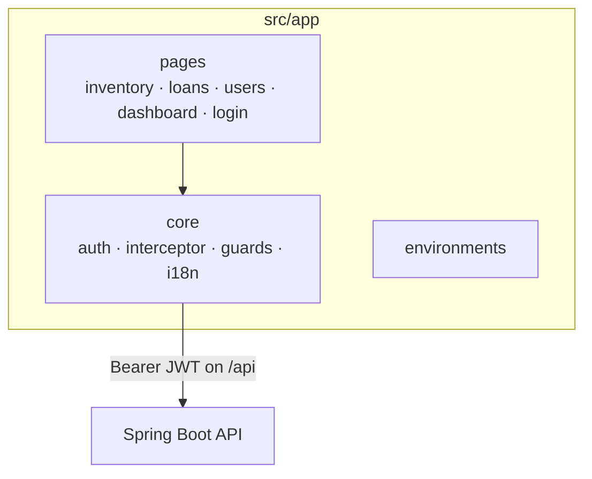

# Stella Frontend (Angular SPA)

The Angular single-page application for Stella. It is built as part of the Maven lifecycle and
served by the Spring Boot API at `/app`. For the full picture see the root
[README](../README.md), the [Architecture guide](../docs/architecture.md) and the
[Frontend Design System](../docs/frontend-design-system.md).

## Structure



The app talks **only to the API** — it never calls Keycloak directly. Login posts credentials to
`POST /api/public/login`; the `authInterceptor` attaches the Bearer token to `/api/**` requests.

## Common commands

```bash
npm install            # install dependencies
npm start              # dev server at http://localhost:4200
npm run build          # production build (also run by the Maven build)
npm run e2e            # Playwright end-to-end tests (needs a running stack)
```

## Notes

- UI components come from PrimeNG, with Stella product tokens/classes on top
  (see the [Design System](../docs/frontend-design-system.md)).
- Internationalization ships pt-BR, en and es.
- Auth tokens are stored in `localStorage`; route guards are UX-only and not a security boundary.
